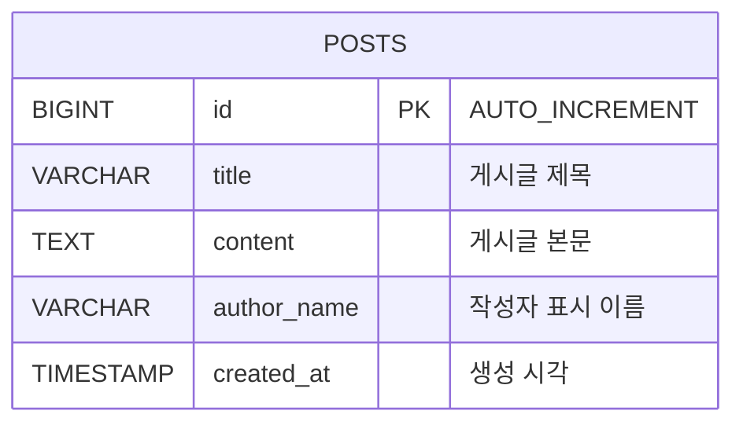

# 012 Cloud DB for MySQL Migration

007번 게시판 실습에서 Ubuntu 서버에 직접 설치한 MariaDB/MySQL 데이터를 Naver Cloud `Cloud DB for MySQL`로 마이그레이션하는 실습입니다.

이 챕터에서는 Database Migration Service(DMS)를 사용해 Source DB에서 Target DB로 데이터를 옮기고, 백엔드 API 서버의 `.env`를 Cloud DB 주소로 바꿔 애플리케이션이 그대로 동작하는지 확인합니다.

> 용어 정정: 데이터베이스 구조 설명은 보통 `EDR`이 아니라 `ERD(Entity Relationship Diagram)`라고 부릅니다.

## 1. 목표 구조

마이그레이션 전:

```text
사용자
  -> Web Server
  -> Backend API Server
  -> Ubuntu DB Server(MariaDB/MySQL)
```

마이그레이션 후:

```text
사용자
  -> Web Server
  -> Backend API Server
  -> Cloud DB for MySQL
```

DMS 작업 흐름:

```text
Source DB 사전 설정
  -> Cloud DB for MySQL 생성
  -> ACG 접근 허용
  -> DMS Endpoint 생성
  -> DMS Migration 생성 및 실행
  -> 데이터 검증
  -> Backend .env의 DB_HOST 전환
```

## 2. 게시판 ERD

현재 게시판 예제는 로그인/회원 기능 없이 게시글만 저장합니다. 따라서 핵심 테이블은 `posts` 하나입니다.

```text
posts
-----
id PK
title
content
author_name
created_at
```

Mermaid ERD:



## 3. 데이터 사전

데이터베이스 이름 기본값:

```text
chapter3_board
```

테이블:

| 테이블 | 설명 |
| --- | --- |
| `posts` | 게시판 글 목록을 저장합니다. |

컬럼:

| 컬럼 | 타입 | Null | Key | 기본값 | 설명 |
| --- | --- | --- | --- | --- | --- |
| `id` | `BIGINT` | `NO` | `PK` | `AUTO_INCREMENT` | 게시글 고유 번호 |
| `title` | `VARCHAR(200)` | `NO` |  |  | 게시글 제목 |
| `content` | `TEXT` | `NO` |  |  | 게시글 본문 |
| `author_name` | `VARCHAR(100)` | `NO` |  | `비가입 유저` | 작성자 표시 이름 |
| `created_at` | `TIMESTAMP` | `NO` |  | `CURRENT_TIMESTAMP` | 게시글 생성 시각 |

DDL:

```sql
CREATE DATABASE IF NOT EXISTS `chapter3_board`
  CHARACTER SET utf8mb4
  COLLATE utf8mb4_unicode_ci;

USE `chapter3_board`;

CREATE TABLE IF NOT EXISTS posts (
  id BIGINT NOT NULL AUTO_INCREMENT,
  title VARCHAR(200) NOT NULL,
  content TEXT NOT NULL,
  author_name VARCHAR(100) NOT NULL DEFAULT '비가입 유저',
  created_at TIMESTAMP NOT NULL DEFAULT CURRENT_TIMESTAMP,
  PRIMARY KEY (id)
);
```

## 4. Source DB 사전 설정

DMS가 Source DB를 읽으려면 보통 아래 준비가 필요합니다.

- Source DB에서 외부 접속 허용
- Source DB 바이너리 로그 활성화
- 마이그레이션 전용 계정 생성
- DMS 또는 Cloud DB 쪽에서 Source DB `3306/tcp`로 접근 가능하도록 ACG 허용

Source DB 서버에서:

```bash
cd "012-cloud db migration/scripts"
sudo SOURCE_DB_ROOT_PASSWORD='DB_ROOT_PASSWORD' \
  MIGRATION_USER='dms_migration' \
  MIGRATION_PASSWORD='ChangeMigrationPassword123!' \
  SOURCE_DATABASE='chapter3_board' \
  ./prepare-source-db.sh
```

스크립트가 하는 일:

- MariaDB/MySQL 설정 파일에 DMS용 바이너리 로그 설정 추가
- `server-id=1`
- `log_bin`
- `binlog_format=ROW`
- `expire_logs_days=5`
- 마이그레이션 계정 생성 및 권한 부여
- DB 서비스 재시작

확인:

```bash
sudo SOURCE_DB_ROOT_PASSWORD='DB_ROOT_PASSWORD' ./check-source-db.sh
```

## 5. ACG 확인

DMS 연결 테스트가 실패하면 대부분 네트워크 또는 권한 문제입니다.

Source DB 서버 ACG inbound:

| 프로토콜 | 포트 | 접근 소스 |
| --- | --- | --- |
| TCP | `3306` | DMS/Cloud DB가 Source DB로 접근할 때 사용하는 대역 또는 NAT Gateway IP |

Target Cloud DB ACG outbound:

| 프로토콜 | 포트 | 목적지 |
| --- | --- | --- |
| TCP | `3306` | Source DB private IP 또는 Source DB 대역 |

수업에서는 Source DB와 Cloud DB가 같은 VPC에 있으면 private IP 기준으로 접근시키는 편이 이해하기 쉽습니다.

## 6. Cloud DB for MySQL 생성

콘솔에서 Target DB를 생성합니다.

```text
Naver Cloud Console
  -> VPC
  -> Cloud DB for MySQL
  -> DB Server 생성
```

권장:

- Source DB와 같은 VPC 또는 통신 가능한 VPC
- Source DB와 같은 MySQL/MariaDB major version 권장
- DB 포트: `3306`
- DB User/Password는 실습용으로 명확하게 기록
- Private domain 예: `db-xxxx.vpc-cdb.ntruss.com`

## 7. DMS Endpoint 생성

```text
Naver Cloud Console
  -> Database Migration Service
  -> Endpoint Management
  -> Endpoint 생성
```

입력값 예시:

| 항목 | 값 |
| --- | --- |
| Endpoint 이름 | `src-board-db` |
| DB 종류 | MySQL 또는 MariaDB |
| Source DB Host | Source DB private IP |
| Port | `3306` |
| User | `dms_migration` |
| Password | `ChangeMigrationPassword123!` |
| Database | `chapter3_board` |

`Test Connection`을 눌러 연결이 되는지 먼저 확인합니다.

## 8. DMS Migration 생성

```text
Naver Cloud Console
  -> Database Migration Service
  -> Migration Management
  -> Migration 생성
```

입력값 예시:

| 항목 | 값 |
| --- | --- |
| Source Endpoint | `src-board-db` |
| Target DB | 생성한 Cloud DB for MySQL |
| Migration 대상 DB | `chapter3_board` |
| Migration 방식 | 콘솔 옵션에 따라 전체 이관 또는 변경분 포함 이관 |

마이그레이션 작업이 완료되면 반드시 완료 상태를 확인합니다. 콘솔에서 마이그레이션 작업을 종료/완료 처리해야 계속 실행 중으로 남지 않습니다.

## 9. 마이그레이션 검증

Source DB와 Target DB의 데이터 수를 비교합니다.

```bash
cd "012-cloud db migration/scripts"

SOURCE_DB_HOST='SOURCE_DB_PRIVATE_IP' \
SOURCE_DB_USER='chapter3_user' \
SOURCE_DB_PASSWORD='ChangeThisPassword123!' \
TARGET_DB_HOST='db-xxxx.vpc-cdb.ntruss.com' \
TARGET_DB_USER='TARGET_USER' \
TARGET_DB_PASSWORD='TARGET_PASSWORD' \
DB_NAME='chapter3_board' \
./compare-post-counts.sh
```

직접 확인:

```bash
mysql -h SOURCE_DB_PRIVATE_IP -u chapter3_user -p chapter3_board \
  -e "SELECT COUNT(*) AS source_posts FROM posts;"

mysql -h db-xxxx.vpc-cdb.ntruss.com -u TARGET_USER -p chapter3_board \
  -e "SELECT COUNT(*) AS target_posts FROM posts;"
```

## 10. Backend DB_HOST 전환

백엔드 서버에서 `.env`의 DB 접속 정보를 Cloud DB로 바꿉니다.

```bash
cd "012-cloud db migration/scripts"

sudo BACKEND_ENV_FILE='/opt/chapter3-backend/.env' \
  DB_HOST='db-xxxx.vpc-cdb.ntruss.com' \
  DB_PORT='3306' \
  DB_USER='TARGET_USER' \
  DB_PASSWORD='TARGET_PASSWORD' \
  DB_NAME='chapter3_board' \
  ./switch-backend-db.sh
```

스크립트는 `.env`를 수정하고 `chapter3-backend` 서비스를 재시작합니다.

확인:

```bash
curl http://localhost:4000/api/health
curl http://localhost:4000/api/posts
sudo systemctl status chapter3-backend --no-pager
```

## 11. 장애 확인 포인트

### DMS Test Connection 실패

- Source DB ACG inbound `3306/tcp` 확인
- Source DB `bind-address=0.0.0.0` 또는 private IP 확인
- migration user 비밀번호 확인
- `mysql -h SOURCE_DB_PRIVATE_IP -u dms_migration -p` 직접 접속 확인

### Migration 실패

- binary log 활성화 확인
- `server-id` 설정 확인
- Source DB와 Target DB major version 차이 확인
- 마이그레이션 계정 권한 확인

### 앱 전환 후 API 실패

- 백엔드 `.env`의 `DB_HOST`, `DB_USER`, `DB_PASSWORD`, `DB_NAME` 확인
- Backend 서버 ACG outbound에서 Cloud DB `3306/tcp` 접근 가능한지 확인
- Cloud DB ACG inbound에서 Backend 서버 private IP 허용 여부 확인

## 12. 참고 자료

- Naver Cloud Database Migration Service 개요: <https://guide.ncloud-docs.com/docs/en/dms-overview>
- Naver Cloud Database Migration Service 사전 조건: <https://guide.ncloud-docs.com/docs/en/dms-spec>
- 참고 블로그: <https://kclouder.tistory.com/8>
