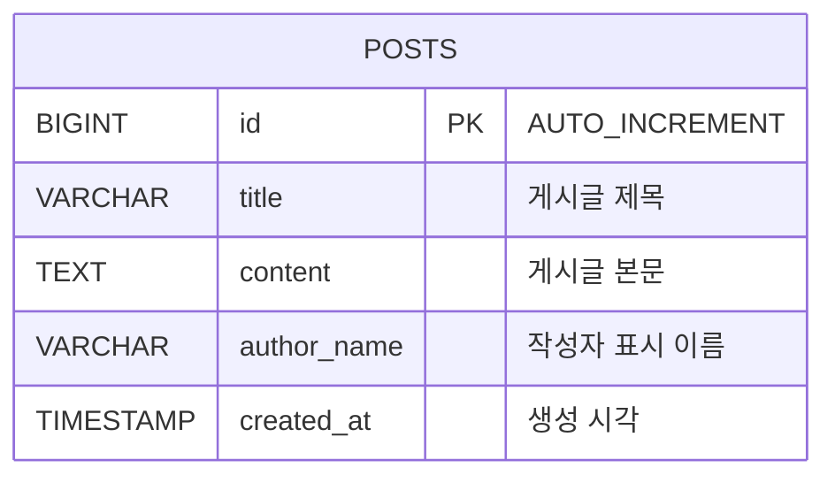

# 017 Cloud DB for MySQL Migration

003번 게시판 실습에서 Ubuntu 서버에 직접 설치한 MariaDB/MySQL 데이터를 Naver Cloud `Cloud DB for MySQL`로 마이그레이션하는 실습입니다.

> 015에서 생성해 현재 서비스 중인 `board_service`를 DMS Target으로 그대로 사용하지 않습니다. DMS Target에는 Source와 같은 이름의 Database가 없어야 하므로 별도의 빈 Cloud DB Service를 만들거나, 015 리소스를 더 이상 사용하지 않을 때만 초기화합니다.

실제 실습에서 재현한 MariaDB relay log 오류와 MySQL 8.0/8.4 `mysqldump` 오류의 원인, 복구, 최종 CDC 검증 결과는 [TROUBLESHOOTING-REPORT.md](./TROUBLESHOOTING-REPORT.md)에 정리했습니다.

이 실습에서는 두 가지 방식으로 Source DB에서 Target DB로 데이터를 옮기는 방법을 소개합니다.

- 방법 A: Naver Cloud Database Migration Service(DMS)
- 방법 B: `mysqldump` 파일 백업/복원

마이그레이션 후에는 백엔드 API 서버의 `.env`를 Cloud DB 주소로 바꿔 애플리케이션이 그대로 동작하는지 확인합니다.

> 용어 정정: 데이터베이스 구조 설명은 보통 `EDR`이 아니라 `ERD(Entity Relationship Diagram)`라고 부릅니다.

## 1. 목표 구조

마이그레이션 전:

```text
사용자
  -> Web Server
  -> Backend API Server
  -> Ubuntu DB Server(MariaDB/MySQL)
```

마이그레이션 후:

```text
사용자
  -> Web Server
  -> Backend API Server
  -> Cloud DB for MySQL
```

방법 A. DMS 작업 흐름:

```text
Source DB 사전 설정
  -> Cloud DB for MySQL 생성
  -> ACG 접근 허용
  -> DMS Endpoint 생성
  -> DMS Migration 생성 및 실행
  -> 데이터 검증
  -> Backend .env의 DB_HOST 전환
```

방법 B. mysqldump 작업 흐름:

```text
Source DB 데이터 변경 중지 또는 점검 시간 확보
  -> mysqldump로 SQL 파일 생성
  -> SQL 파일을 Target Cloud DB에 복원
  -> 데이터 검증
  -> Backend .env의 DB_HOST 전환
```

## 1-1. DMS와 mysqldump 비교

| 방식 | 적합한 상황 | 장점 | 주의점 |
| --- | --- | --- | --- |
| DMS | 운영 중인 DB를 Cloud DB로 옮기고 싶을 때 | 콘솔 기반, 연결 테스트 제공, 변경분 이관 시나리오 설명에 적합 | Source DB binlog, 계정 권한, ACG 설정이 필요 |
| mysqldump | 작은 DB를 단순하게 백업/복원하고 싶을 때 | 원리가 쉽고 파일로 남기기 좋음, 백업/복구 수업에 적합 | 덤프 시점 이후 변경분은 자동 반영되지 않음 |

수업에서는 둘 다 보여주는 것이 좋습니다. DMS는 클라우드 관리형 마이그레이션을 설명하기 좋고, `mysqldump`는 데이터베이스 백업 파일이 실제로 어떻게 만들어지고 복원되는지 이해시키기 좋습니다.

## 1-2. 시작 전에 기록할 값

아래 값이 하나라도 빠지면 DMS 연결 테스트를 끝까지 진행할 수 없습니다.

| 값 | 예시 | 사용하는 곳 |
| --- | --- | --- |
| Source DB 사설 IP | `10.0.1.30` | DMS Endpoint, Target ACG outbound |
| Source DB 공인 IP | `49.50.x.x` | 서로 다른 VPC에서 NAT로 연결할 때만 사용 |
| Source DB 관리자 비밀번호 | `RootPass123!` | Source 설정 및 계정 생성 |
| Target DB private domain | `db-xxxx.vpc-cdb.ntruss.com` | 백엔드 전환, Target 접속 |
| Target DB 사설 IP 또는 서브넷 | `10.0.2.0/24` | Source ACG inbound와 Source DB 계정 Host |
| Target DB 사용자/비밀번호 | 콘솔에서 생성 | 복원, 검증, 백엔드 전환 |

먼저 Source와 Target이 같은 VPC인지 확인합니다. 같은 VPC면 사설 IP/서브넷으로 연결하고, 서로 다른 VPC면 VPC Peering과 양쪽 Route Table을 구성합니다. 공인 IP로 연결할 때는 Target DB 서브넷의 Route Table에 NAT Gateway가 필요합니다.

## 2. 게시판 ERD

현재 게시판 예제는 로그인/회원 기능 없이 게시글만 저장합니다. 따라서 핵심 테이블은 `posts` 하나입니다.

```text
posts
-----
id PK
title
content
author_name
created_at
```

Mermaid ERD:



## 3. 데이터 사전

데이터베이스 이름 기본값:

```text
board_service
```

테이블:

| 테이블 | 설명 |
| --- | --- |
| `posts` | 게시판 글 목록을 저장합니다. |

컬럼:

| 컬럼 | 타입 | Null | Key | 기본값 | 설명 |
| --- | --- | --- | --- | --- | --- |
| `id` | `BIGINT` | `NO` | `PK` | `AUTO_INCREMENT` | 게시글 고유 번호 |
| `title` | `VARCHAR(200)` | `NO` |  |  | 게시글 제목 |
| `content` | `TEXT` | `NO` |  |  | 게시글 본문 |
| `author_name` | `VARCHAR(100)` | `NO` |  | `비가입 유저` | 작성자 표시 이름 |
| `created_at` | `TIMESTAMP` | `NO` |  | `CURRENT_TIMESTAMP` | 게시글 생성 시각 |

DDL:

```sql
CREATE DATABASE IF NOT EXISTS `board_service`
  CHARACTER SET utf8mb4
  COLLATE utf8mb4_unicode_ci;

USE `board_service`;

CREATE TABLE IF NOT EXISTS posts (
  id BIGINT NOT NULL AUTO_INCREMENT,
  title VARCHAR(200) NOT NULL,
  content TEXT NOT NULL,
  author_name VARCHAR(100) NOT NULL DEFAULT '비가입 유저',
  created_at TIMESTAMP NOT NULL DEFAULT CURRENT_TIMESTAMP,
  PRIMARY KEY (id)
);
```

## 4. Source DB 사전 설정

DMS가 Source DB를 읽으려면 보통 아래 준비가 필요합니다.

- Source DB에서 외부 접속 허용
- Source DB 바이너리 로그 활성화
- 마이그레이션 전용 계정 생성
- DMS 또는 Cloud DB 쪽에서 Source DB `3306/tcp`로 접근 가능하도록 ACG 허용

Naver Cloud DB for MySQL의 DB 사용자 비밀번호 조건에 맞춰 예시 비밀번호는 8자 이상, 20자 이하인 `MigratePass123!`를 사용합니다.

003 설치 스크립트는 `root@localhost`에 `DB_ROOT_PASSWORD`를 설정합니다. 따라서 003을 그대로 설치한 Source DB에서는 DB 서버의 `003-three tier web app/db/.env`에 기록한 비밀번호를 사용합니다.

Source DB 서버에서 MariaDB 바이너리 로그와 외부 리슨을 설정합니다.

```bash
sudo tee /etc/mysql/mariadb.conf.d/60-dms-source.cnf >/dev/null <<'EOF'
[mysqld]
server-id=1
log_bin=mysql-bin
binlog_format=ROW
binlog_row_image=FULL
expire_logs_days=5
bind-address=0.0.0.0
EOF

sudo systemctl restart mariadb
sudo systemctl is-active mariadb
```

이어서 DMS 전용 계정을 생성합니다. 관리자 암호에는 003 DB 서버의 `.env`에 기록한 `DB_ROOT_PASSWORD`를 입력합니다. 이 실습의 Target Cloud DB Subnet `10.10.120.0/24`를 MySQL Host 형식인 `10.10.120.%`로 지정합니다.

```bash
sudo mariadb -u root -p <<'SQL'
CREATE USER IF NOT EXISTS 'dms_migration'@'10.10.120.%'
  IDENTIFIED VIA mysql_native_password USING PASSWORD('MigratePass123!');
ALTER USER 'dms_migration'@'10.10.120.%'
  IDENTIFIED VIA mysql_native_password USING PASSWORD('MigratePass123!');
GRANT RELOAD, PROCESS, SHOW DATABASES, REPLICATION SLAVE, REPLICATION CLIENT
  ON *.* TO 'dms_migration'@'10.10.120.%';
GRANT SELECT ON mysql.* TO 'dms_migration'@'10.10.120.%';
GRANT SELECT, SHOW VIEW, LOCK TABLES, TRIGGER
  ON board_service.* TO 'dms_migration'@'10.10.120.%';
FLUSH PRIVILEGES;
SQL
```

위 명령이 하는 일:

- MariaDB/MySQL 설정 파일에 DMS용 바이너리 로그 설정 추가
- `server-id=1`
- `log_bin`
- `binlog_format=ROW`
- `binlog_row_image=FULL`
- `expire_logs_days=5`
- DMS가 요구하는 `mysql_native_password` 방식으로 마이그레이션 계정 생성
- 마이그레이션 계정에 백업/복제 권한 부여
- DB 서비스 재시작

확인:

```bash
sudo mariadb -u root -p board_service <<'SQL'
SHOW VARIABLES
WHERE Variable_name IN (
  'server_id', 'log_bin', 'binlog_format',
  'binlog_row_image', 'expire_logs_days', 'bind_address'
);
SHOW MASTER STATUS;
SHOW GRANTS FOR 'dms_migration'@'10.10.120.%';
SELECT COUNT(*) AS total_posts FROM posts;
SQL
```

`log_bin=ON`, `binlog_format=ROW`, `binlog_row_image=FULL`이고 `SHOW MASTER STATUS`에 바이너리 로그 파일이 표시되어야 다음 단계로 넘어갑니다. `ERROR 1227 ... CREATE USER privilege`가 나오면 관리자 계정이 아니라 일반 애플리케이션 계정으로 접속한 것입니다.

Source DB의 binlog 설정, 마이그레이션 관련 전역 권한, `board_service` 스키마 권한과 현재 게시글 범위를 한 번에 확인하려면 다음 SQL을 실행합니다.

```bash
cd "017-cloud db migration"
sudo mariadb -u root \
  -p board_service \
  < sql/source-readiness.sql
```

결과에서 최소한 다음 항목을 확인합니다.

- `server_id`가 `0`이 아닌지
- `log_bin=ON`, `binlog_format=ROW`인지
- `SHOW MASTER STATUS` 결과가 비어 있지 않은지
- 마이그레이션 계정에 복제 관련 권한과 `board_service` 조회 권한이 있는지
- `posts` 테이블과 이관할 게시글이 실제로 존재하는지

### Source 준비 상태를 SQL로 직접 확인

스크립트 결과만 보지 않고 Source DB 서버에서 관리자 계정으로 접속해 항목별 쿼리를 직접 실행합니다.

```bash
sudo mariadb -u root -p board_service
```

먼저 DMS가 변경 데이터를 읽는 데 필요한 binlog 설정을 확인합니다.

```sql
SHOW VARIABLES
WHERE Variable_name IN (
  'server_id',
  'log_bin',
  'binlog_format',
  'binlog_row_image',
  'expire_logs_days',
  'bind_address'
);

SHOW MASTER STATUS;
```

`server_id`는 `0`이 아니어야 하고, `log_bin=ON`, `binlog_format=ROW`여야 합니다. `SHOW MASTER STATUS`에서 binlog 파일명과 위치가 출력되어야 DMS가 읽을 변경 로그가 존재하는 상태입니다.

마이그레이션 계정에 복제 관련 전역 권한과 게시판 DB 조회 권한이 부여됐는지 확인합니다.

```sql
SELECT GRANTEE, PRIVILEGE_TYPE
FROM information_schema.USER_PRIVILEGES
WHERE PRIVILEGE_TYPE IN (
  'RELOAD',
  'PROCESS',
  'SHOW DATABASES',
  'REPLICATION SLAVE',
  'REPLICATION CLIENT'
)
ORDER BY GRANTEE, PRIVILEGE_TYPE;

SELECT GRANTEE, TABLE_SCHEMA, PRIVILEGE_TYPE
FROM information_schema.SCHEMA_PRIVILEGES
WHERE TABLE_SCHEMA = 'board_service'
ORDER BY GRANTEE, PRIVILEGE_TYPE;
```

결과의 `GRANTEE`에서 DMS Endpoint에 입력할 계정을 찾습니다. 계정이 없거나 `board_service`의 `SELECT` 권한이 없다면 Endpoint 연결은 되더라도 테이블 이관이 실패할 수 있습니다.

마이그레이션 시작 전 기준값도 직접 기록합니다.

```sql
SELECT
  COUNT(*) AS total_posts,
  MIN(id) AS first_post_id,
  MAX(id) AS last_post_id,
  MIN(created_at) AS first_created_at,
  MAX(created_at) AS last_created_at
FROM posts;

SELECT id, title, content, author_name, created_at
FROM posts
ORDER BY id DESC
LIMIT 5;
```

`total_posts`, `last_post_id`, 최신 게시글 제목과 본문을 기록해 두면 마이그레이션 후 Target이 어느 시점까지 따라왔는지 판단할 수 있습니다.

## 5. ACG 확인

DMS 연결 테스트가 실패하면 대부분 네트워크 또는 권한 문제입니다.

같은 VPC에 있는 Source DB 서버 ACG inbound:

별도의 DMS 서버 IP를 허용하는 것이 아닙니다. Target Cloud DB가 Source DB에 연결하므로 Target Cloud DB가 속한 Subnet CIDR을 접근 소스로 사용합니다.

콘솔의 `Cloud DB for MySQL > DB Server`에서 Target DB의 Subnet을 확인하고, `VPC > Subnet`에서 해당 Subnet의 IP 주소 범위(CIDR)를 확인합니다.

| 프로토콜 | 포트 | 접근 소스 |
| --- | --- | --- |
| TCP | `3306` | Target DB가 속한 서브넷 CIDR |

Target Cloud DB ACG outbound:

| 프로토콜 | 포트 | 목적지 |
| --- | --- | --- |
| TCP | `3306` | Source DB 사설 IP 또는 Source DB 서브넷 |

Source DB의 OS 방화벽과 실제 리슨 주소도 확인합니다.

```bash
sudo ss -lntp | grep ':3306'
sudo ufw status
```

서로 다른 VPC라면 ACG만으로는 연결되지 않습니다. 양방향 VPC Peering과 Route Table이 필요합니다. 공인 IP 경로를 사용할 때는 Target DB 쪽 NAT Gateway IP를 Source ACG와 DB 계정 Host에 허용합니다.

## 6. Cloud DB for MySQL 생성

콘솔에서 Target DB를 생성합니다.

```text
Naver Cloud Console
  -> VPC
  -> Cloud DB for MySQL
  -> DB Server 생성
```

권장:

- Source DB와 같은 VPC 또는 통신 가능한 VPC
- Source DB와 같은 MySQL/MariaDB major version 권장
- DB 포트: `3306`
- DB User/Password는 실습용으로 명확하게 기록
- Private domain 예: `db-xxxx.vpc-cdb.ntruss.com`

Cloud DB for MySQL은 사용자가 DB 서버 OS에 접속해서 `root@localhost`로 계정을 만드는 방식이 아닙니다. Naver Cloud 콘솔의 `Cloud DB for MySQL > DB Server > Manage DB > Manage DB user`에서 DB User를 만들고 접근 대역을 허용합니다.

DMS를 시작하기 전 Target에 `board_service`를 미리 만들지 마십시오. Target에 Source와 같은 이름의 데이터베이스가 이미 있으면 Migration 작업이 실행되지 않습니다. DB 사용자만 콘솔에서 만들고, 데이터베이스와 테이블은 DMS가 이관하도록 둡니다.

| USER_ID | HOST(IP) | DB 권한 | 암호 예시 | 용도 |
| --- | --- | --- | --- | --- |
| `board_admin` | 관리 서버 IP 대역 예: `10.10.10.%` | `DDL` | `BoardAdmin123!` | mysqldump 복원, 스키마 및 검증 작업 |
| `board_app` | Backend Subnet 예: `10.10.110.%` | `CRUD` | `BoardApp123!` | 마이그레이션 완료 후 Backend 연결 |

두 계정 모두 시스템 테이블은 선택하지 않습니다. `DDL`은 `CRUD`와 `READ`를 포함하고, `CRUD`는 게시글 조회·등록·수정·삭제에 필요한 권한입니다. DMS 작업은 Target DB User를 입력하는 방식이 아니라 생성한 Cloud DB Service를 Target으로 선택합니다. DB User 계정은 DMS로 이관되지 않으므로 위 두 계정은 Target에 직접 생성해야 합니다.

공식 문서의 접속 예시도 `root`가 아니라 콘솔에서 확인한 `user_id`로 접속합니다.

```bash
mysql -h db-xxxx.vpc-cdb.ntruss.com -u board_admin -p --port 3306
```

따라서 이 실습에서 계정은 이렇게 나눠서 이해합니다.

| 위치 | 계정 | 만드는 방법 |
| --- | --- | --- |
| Source Ubuntu DB | `dms_migration` | MariaDB 관리자 SQL로 생성, DMS Endpoint에서 사용 |
| Target Cloud DB for MySQL | `board_admin` | Naver Cloud Console에서 `DDL`로 생성 |
| Target Cloud DB for MySQL | `board_app` | Naver Cloud Console에서 `CRUD`로 생성 |

## 7. 방법 A: DMS Endpoint 생성

```text
Naver Cloud Console
  -> Database Migration Service
  -> Endpoint Management
  -> Endpoint 생성
```

입력값 예시:

| 항목 | 값 |
| --- | --- |
| Endpoint 이름 | `src-board-db` |
| DB 종류 | MySQL 또는 MariaDB |
| Source DB Host | 같은 VPC면 Source DB 사설 IP, 공인 경로면 Source DB 공인 IP |
| Port | `3306` |
| User | `dms_migration` |
| Password | `MigratePass123!` |
| Database | `board_service` |

`Test Connection`을 눌러 연결이 되는지 먼저 확인합니다.

Endpoint 비밀번호는 반드시 `mysql_native_password` 계정의 비밀번호여야 합니다. Source DB에서 `SELECT User, Host, plugin FROM mysql.user WHERE User='dms_migration';` 결과가 다른 값이면 Endpoint 연결 테스트 전에 계정을 다시 준비합니다.

## 8. 방법 A: DMS Migration 생성

```text
Naver Cloud Console
  -> Database Migration Service
  -> Migration Management
  -> Migration 생성
```

입력값 예시:

| 항목 | 값 |
| --- | --- |
| Source Endpoint | `src-board-db` |
| Target DB | 생성한 Cloud DB for MySQL |
| Migration 대상 DB | `board_service` |
| Backup type | 작은 실습 DB는 `mysqldump` |

작업 생성 화면의 `Test Connection`이 성공하면 Source/Target DB 버전과 GTID 상태가 자동으로 표시됩니다. 마이그레이션은 Exporting, Importing, Replication 순서로 진행됩니다. Replication 완료 상태에서도 Source 변경분은 계속 동기화되며, 최종 검증과 쓰기 중지 후 콘솔의 [Complete]를 눌러야 Target이 정상 운영 상태로 전환됩니다.

## 9. 방법 B: mysqldump로 이관

`mysqldump` 방식은 Source DB의 내용을 SQL 파일로 저장한 뒤 Target Cloud DB for MySQL에 복원하는 방식입니다.

이 방식은 DMS보다 단순하지만, 덤프를 뜬 이후 Source DB에 새로 들어온 데이터는 자동으로 Target DB에 반영되지 않습니다. 정확한 실습을 위해서는 아래 중 하나를 선택합니다.

- 게시판 백엔드와 자동 게시글 생성 서비스를 잠시 중지한 뒤 덤프
- 수업용이라면 덤프 시점 이후 데이터는 누락될 수 있음을 설명하고 진행

백엔드와 자동 게시글 생성을 잠시 멈추는 예시:

```bash
sudo systemctl stop board-service-post-seeder || true
sudo systemctl stop board-service-backend
```

Source DB에서 덤프 파일 생성:

```bash
cd "017-cloud db migration/scripts"

SOURCE_DB_HOST='SOURCE_DB_PRIVATE_IP' \
SOURCE_DB_USER='board_app' \
SOURCE_DB_PASSWORD='BoardApp123!' \
DB_NAME='board_service' \
DUMP_FILE='/tmp/board_service.sql' \
./dump-source-db.sh
```

Cloud DB for MySQL에 복원:

```bash
TARGET_DB_HOST='db-xxxx.vpc-cdb.ntruss.com' \
TARGET_DB_USER='board_admin' \
TARGET_DB_PASSWORD='BoardAdmin123!' \
DUMP_FILE='/tmp/board_service.sql' \
./restore-target-db.sh
```

복원 후 백엔드는 다시 켤 수 있습니다. 단, DB 전환 전이라면 기존 Source DB로 다시 쓰게 됩니다.

```bash
sudo systemctl start board-service-backend
sudo systemctl start board-service-post-seeder || true
```

`mysqldump` 명령어를 직접 쓰면 아래와 같습니다.

```bash
MYSQL_PWD='SOURCE_PASSWORD' mysqldump \
  -h SOURCE_DB_PRIVATE_IP \
  -u board_app \
  --single-transaction \
  --quick \
  --routines \
  --triggers \
  --events \
  --default-character-set=utf8mb4 \
  --databases board_service \
  > /tmp/board_service.sql
```

복원 명령어:

```bash
MYSQL_PWD='BoardAdmin123!' mysql \
  -h db-xxxx.vpc-cdb.ntruss.com \
  -u board_admin \
  < /tmp/board_service.sql
```

## 10. 마이그레이션 검증

Source DB와 Target DB의 데이터 수와 내용 지문을 비교합니다.

```bash
cd "017-cloud db migration/scripts"

SOURCE_DB_HOST='SOURCE_DB_PRIVATE_IP' \
SOURCE_DB_USER='board_app' \
SOURCE_DB_PASSWORD='BoardApp123!' \
TARGET_DB_HOST='db-xxxx.vpc-cdb.ntruss.com' \
TARGET_DB_USER='board_app' \
TARGET_DB_PASSWORD='BoardApp123!' \
DB_NAME='board_service' \
./compare-post-counts.sh
```

스크립트는 다음 항목을 함께 비교하며 하나라도 다르면 종료 코드 `2`를 반환합니다.

- `posts` 컬럼 구조
- 전체 행 수
- 첫 번째·마지막 게시글 ID
- 모든 게시글의 제목, 본문, 작성자, 작성 시각을 반영한 체크섬
- 불일치가 발생한 게시글 ID와 행별 제목 길이·본문 길이·체크섬

체크섬은 빠른 실습 검증을 위한 값입니다. 백업 보존이나 법적 무결성 증명에 사용하는 암호학적 해시는 아닙니다.

직접 확인:

```bash
mysql -h SOURCE_DB_PRIVATE_IP -u board_app -p board_service \
  -e "SELECT COUNT(*) AS source_posts FROM posts;"

mysql -h db-xxxx.vpc-cdb.ntruss.com -u board_app -p board_service \
  -e "SELECT COUNT(*) AS target_posts FROM posts;"
```

### Source와 Target을 직접 비교하는 SQL 실습

터미널 두 개를 열어 한쪽은 Source, 다른 한쪽은 Target에 접속합니다. 이후 아래 쿼리를 양쪽에서 똑같이 실행해 결과를 비교합니다.

```bash
# 터미널 1: Source
mysql -h SOURCE_DB_PRIVATE_IP -u board_app -p board_service

# 터미널 2: Target Cloud DB
mysql -h db-xxxx.vpc-cdb.ntruss.com -u board_app -p board_service
```

먼저 테이블 컬럼 순서와 타입을 비교합니다.

```sql
SELECT
  ORDINAL_POSITION,
  COLUMN_NAME,
  COLUMN_TYPE,
  IS_NULLABLE,
  COLUMN_KEY,
  COLUMN_DEFAULT,
  EXTRA,
  COLLATION_NAME
FROM information_schema.COLUMNS
WHERE TABLE_SCHEMA = DATABASE()
  AND TABLE_NAME = 'posts'
ORDER BY ORDINAL_POSITION;
```

Source와 Target의 컬럼 개수, 타입, `NULL` 허용 여부, 기본 키, 기본값이 같아야 합니다. 다음으로 행 수와 데이터 범위를 비교합니다.

```sql
SELECT
  COUNT(*) AS total_posts,
  MIN(id) AS first_post_id,
  MAX(id) AS last_post_id,
  MIN(created_at) AS first_created_at,
  MAX(created_at) AS last_created_at
FROM posts;
```

최종 전환 시점에는 Source와 Target의 다섯 값이 모두 같아야 합니다. DMS 실행 중이라면 Target의 `last_post_id`가 잠시 작을 수 있지만 DMS 지연이 `0`이 된 뒤에는 같아야 합니다.

행 수만 같고 실제 내용이 다른 경우를 찾기 위해 전체 데이터 지문을 비교합니다.

```sql
SELECT
  COUNT(*) AS total_posts,
  COALESCE(SUM(CAST(row_crc AS UNSIGNED)), 0) AS checksum_sum,
  COALESCE(BIT_XOR(row_crc), 0) AS checksum_xor
FROM (
  SELECT CRC32(CONCAT_WS(
    CHAR(31),
    CAST(id AS CHAR),
    title,
    content,
    author_name,
    CAST(UNIX_TIMESTAMP(created_at) AS CHAR)
  )) AS row_crc
  FROM posts
) AS post_fingerprints;
```

세 값이 Source와 Target에서 모두 같아야 합니다. 체크섬이 다르면 특정 게시글을 골라 실제 값을 확인합니다. 아래 `@post_id`에는 비교 스크립트가 알려준 불일치 ID나 최신 ID를 넣습니다.

```sql
SET @post_id = 1;

SELECT
  id,
  title,
  content,
  CHAR_LENGTH(title) AS title_length,
  CHAR_LENGTH(content) AS content_length,
  author_name,
  created_at,
  CRC32(CONCAT_WS(
    CHAR(31),
    CAST(id AS CHAR),
    title,
    content,
    author_name,
    CAST(UNIX_TIMESTAMP(created_at) AS CHAR)
  )) AS row_checksum
FROM posts
WHERE id = @post_id;
```

제목과 본문을 눈으로 확인하고 길이, 작성자, 작성 시각, `row_checksum`을 비교합니다. 실제 데이터 자체의 이상 여부도 양쪽에서 확인합니다.

```sql
SELECT
  COALESCE(SUM(CASE WHEN TRIM(title) = '' THEN 1 ELSE 0 END), 0) AS empty_title_count,
  COALESCE(SUM(CASE WHEN TRIM(content) = '' THEN 1 ELSE 0 END), 0) AS empty_content_count,
  COALESCE(SUM(CASE WHEN TRIM(author_name) = '' THEN 1 ELSE 0 END), 0) AS empty_author_count,
  COALESCE(SUM(CASE WHEN created_at > CURRENT_TIMESTAMP THEN 1 ELSE 0 END), 0) AS future_created_at_count
FROM posts;

SELECT title, author_name, COUNT(*) AS duplicate_candidate_count
FROM posts
GROUP BY title, author_name
HAVING COUNT(*) > 1
ORDER BY duplicate_candidate_count DESC, title;
```

빈 값과 미래 시각은 정상 데이터라면 모두 `0`이어야 합니다. 중복 후보는 반드시 오류라는 뜻은 아니므로 Source에도 같은 행이 있었는지 실제 본문과 작성 시각을 추가 조회해 판단합니다.

| 비교 결과 | 해석과 확인 사항 |
| --- | --- |
| 행 수가 다름 | DMS 지연, 덤프 이후 Source 쓰기, 일부 행 누락 여부 확인 |
| 행 수는 같고 체크섬이 다름 | 같은 ID의 제목·본문·작성자·작성 시각을 직접 비교 |
| 스키마가 다름 | Target의 컬럼 타입, 기본값, 문자셋과 복원 로그 확인 |
| 최신 ID만 Target에 없음 | 쓰기를 중지했는지, DMS 지연이 `0`인지 확인 |
| Source와 Target 결과가 모두 같음 | 백엔드 전환 전 데이터 검증 통과 |

각 DB의 스키마, ID·시간 범위, 체크섬, 빈 값·미래 시각 같은 이상 데이터, 중복 후보, 최신 10건의 실제 제목·본문과 작성자별 건수를 직접 확인하려면 동일한 SQL을 Source와 Target에 각각 실행합니다.

```bash
cd "017-cloud db migration"

mysql -h SOURCE_DB_PRIVATE_IP \
  -u board_app \
  -p board_service \
  < sql/migration-validation.sql

mysql -h db-xxxx.vpc-cdb.ntruss.com \
  -u board_app \
  -p board_service \
  < sql/migration-validation.sql
```

DMS로 변경분까지 이관하는 동안에는 Source에 쓰기가 계속 발생할 수 있으므로 일시적으로 값이 다를 수 있습니다. 최종 전환 직전에는 게시판 백엔드와 자동 게시글 생성기를 중지하고, DMS 지연이 `0`이 된 뒤 다시 검증해야 합니다. `mysqldump` 방식은 덤프를 만든 시점부터 Source 쓰기를 중지한 상태에서 비교해야 합니다.

## 11. Backend DB_HOST 전환

백엔드 서버에서 `.env`의 DB 접속 정보를 Cloud DB로 바꿉니다.

```bash
cd "017-cloud db migration/scripts"

sudo BACKEND_ENV_FILE='/opt/board-service-backend/.env' \
  DB_HOST='db-xxxx.vpc-cdb.ntruss.com' \
  DB_PORT='3306' \
  DB_USER='board_app' \
  DB_PASSWORD='BoardApp123!' \
  DB_NAME='board_service' \
  ./switch-backend-db.sh
```

스크립트는 `.env`를 수정하고 `board-service-backend` 서비스를 재시작합니다.

확인:

```bash
curl http://localhost:4000/api/health
curl http://localhost:4000/api/posts
sudo systemctl status board-service-backend --no-pager
```

## 12. 장애 확인 포인트

### DMS Test Connection 실패

- Source와 Target이 같은 VPC인지, 다른 VPC면 Peering/Route Table이 양방향인지 확인
- Source DB ACG inbound가 Target DB 서브넷 또는 NAT Gateway IP의 `3306/tcp`를 허용하는지 확인
- Target DB ACG outbound가 Source DB IP/서브넷의 `3306/tcp`를 허용하는지 확인
- Source DB `bind-address=0.0.0.0` 또는 private IP 확인
- DMS 계정 Host가 Target DB 서브넷/IP와 일치하는지 확인
- DMS 계정의 인증 플러그인이 `mysql_native_password`인지 확인
- `sudo SOURCE_DB_ADMIN_PASSWORD='...' ./check-source-db.sh`가 통과하는지 확인

### Migration 실패

- binary log 활성화 확인
- `server-id` 설정 확인
- Source DB와 Target DB major version 차이 확인
- 마이그레이션 계정 권한 확인
- Target에 `board_service`가 이미 존재하지 않는지 확인
- Source DB의 테이블 엔진과 문자셋이 DMS 지원 범위인지 확인
- MariaDB가 EOL 버전이면 Source 업그레이드 또는 호환되는 Target 버전 검토

### Replication에서 `Last_Errno 13121` 발생

초기 Export/Import와 테이블 점검은 성공했지만 새 Source 행이 Target에 반영되지 않고, 작업 상세에 아래 오류가 표시될 수 있습니다.

```text
Relay log read failure: Could not parse relay log event entry
Last_SQL_Errno: 13121
Slave_IO_Running: Yes
Slave_SQL_Running: No
```

이 상태는 네트워크 문제가 아닙니다. IO 스레드는 Source binlog를 읽었지만 Target MySQL SQL 스레드가 MariaDB 전용 GTID/row 이벤트를 해석하지 못한 엔진 호환성 문제입니다. Naver Cloud는 MariaDB Source를 지원하지만 같은 major version 간 마이그레이션을 권장하며, 버전 조합에 따라 호환성 오류가 발생할 수 있다고 안내합니다.

수업 서버를 재설치해도 되는 경우에는 Source 데이터를 백업한 뒤 Ubuntu 공식 MySQL 8.0으로 변환하고 DMS 작업을 새로 생성할 수 있습니다. 다음 스크립트는 `board_service`를 덤프하고 MariaDB 데이터·설정을 별도 백업 디렉터리로 이동한 후 MySQL을 설치하므로 운영 서버에서는 스냅샷을 먼저 생성해야 합니다.

```bash
cd "/root/cloud-infrastructure-lecture-example/017-cloud db migration/scripts"
sudo CONFIRM_CONVERSION=YES ./convert-mariadb-source-to-mysql.sh
```

Target이 MySQL 8.4이면 아래 절의 DMS `mysqldump` 호환성 문제를 피하기 위해 Source도 MySQL 8.4 LTS로 맞춥니다.

```bash
sudo CONFIRM_UPGRADE=YES ./upgrade-mysql-source-to-84.sh
```

변환 후에는 실패한 DMS 작업을 삭제하고, Target의 중복 `board_service`를 삭제한 다음 Test Connection부터 새로 실행합니다. `복제 오류 스킵`은 해당 트랜잭션을 누락시킬 수 있으므로 데이터 정합성 검증 없이 해결책으로 사용하지 않습니다.

### Exporting에서 `SHOW BINARY LOG STATUS` 문법 오류 발생

Source MySQL 8.0, Target MySQL 8.4 조합에서 NCP DMS가 MySQL 8.4용 `mysqldump`를 사용하면 Exporting 단계가 아래 오류로 종료될 수 있습니다.

```text
mysqldump: Couldn't execute 'SHOW BINARY LOG STATUS':
You have an error in your SQL syntax ... near 'LOG STATUS' at line 1 (1064)
```

`SHOW BINARY LOG STATUS`는 MySQL 8.4 명령이며 MySQL 8.0은 `SHOW MASTER STATUS`를 사용합니다. 네트워크나 DMS 계정 권한 문제가 아니므로 재시작만 반복해도 해결되지 않습니다. 이 실습처럼 Target 버전을 바꿀 수 없다면 Source를 같은 MySQL 8.4 LTS로 업그레이드한 뒤 실패 작업을 삭제하고 새 작업을 생성합니다.

```bash
cd "/root/cloud-infrastructure-lecture-example/017-cloud db migration/scripts"
sudo CONFIRM_UPGRADE=YES ./upgrade-mysql-source-to-84.sh
sudo SOURCE_DB_ADMIN_PASSWORD='...' ./check-source-db.sh
```

MySQL 8.4는 `mysql_native_password` 인증 플러그인을 기본 비활성화합니다. 제공 스크립트는 NCP DMS 계정을 계속 사용할 수 있도록 플러그인을 명시적으로 활성화합니다. 운영 환경에서는 DMS 지원 인증 방식과 계정 정책을 먼저 확인하고 마이그레이션 전용 계정에만 적용합니다.

### 앱 전환 후 API 실패

- 백엔드 `.env`의 `DB_HOST`, `DB_USER`, `DB_PASSWORD`, `DB_NAME` 확인
- Backend 서버 ACG outbound에서 Cloud DB `3306/tcp` 접근 가능한지 확인
- Cloud DB ACG inbound에서 Backend 서버 private IP 허용 여부 확인

### mysqldump 실패

- Source DB 접속 정보 확인
- Source DB ACG inbound `3306/tcp` 확인
- `mysqldump` 패키지 설치 여부 확인
- Target Cloud DB 계정에 DB 생성/테이블 생성 권한이 있는지 확인
- Source와 Target의 MySQL/MariaDB 버전 차이 확인

## 13. 참고 자료

- Naver Cloud DMS Source/Target 접속 설정: <https://guide.ncloud-docs.com/docs/dms-connect>
- Naver Cloud DMS Endpoint 관리: <https://guide.ncloud-docs.com/docs/dms-endpointmanagement>
- Naver Cloud DMS Migration 관리: <https://guide.ncloud-docs.com/docs/dms-migrationmanagement>
- Naver Cloud DMS 지원 사양: <https://guide.ncloud-docs.com/docs/dms-spec>
- Naver Cloud DMS 접속 문제 해결: <https://guide.ncloud-docs.com/docs/dms-troubleshot-access>
