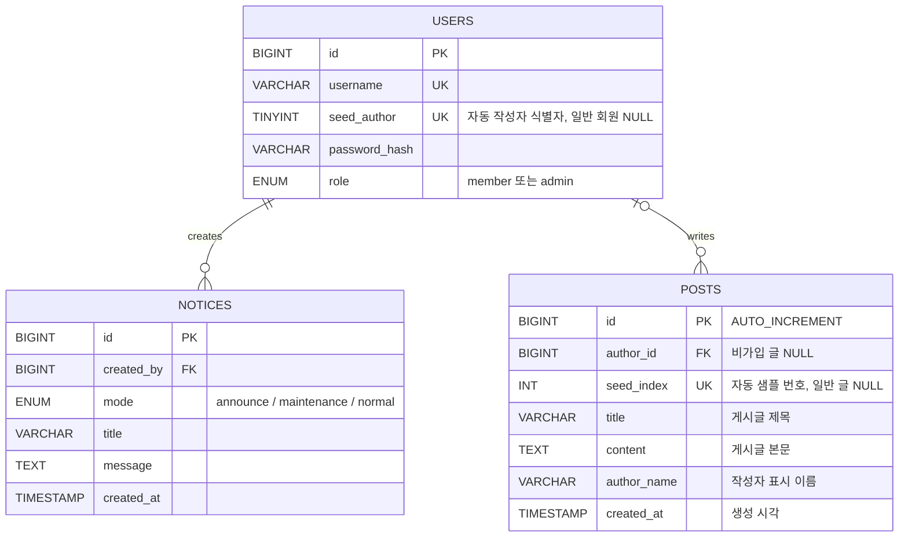

# 402 Cloud DB for MySQL Migration

003번 게시판 실습에서 Ubuntu 서버에 직접 설치한 MariaDB/MySQL 데이터를 Naver Cloud `Cloud DB for MySQL`로 마이그레이션하는 실습입니다.

강의는 **401 생성·연결 → 402 마이그레이션 → 403 백업·복구** 순서입니다. 이관 후 같은 Cloud DB의 `board_service`를 백업·복구 대상으로 사용합니다.

> 이 실습은 추가 Cloud DB를 만들지 않고 401 Cloud DB 서버를 Target으로 재사용합니다. DMS 시작 전에 Backend와 자동 게시글 서비스를 중지하고 Target의 `board_service`를 삭제합니다. 401에서 작성한 Target 데이터가 필요하면 삭제 전에 내보내거나 백업을 확보합니다. Cloud DB 서버와 DB User, 003 Source의 원본 데이터는 유지합니다.

실습 기준으로 Source Ubuntu DB는 `lab7-sub-pri-kr2` (`10.10.120.0/24`), Target Cloud DB는 `lab7-sub-pri-kr1` (`10.10.110.0/24`)에 있습니다. 따라서 Source의 DMS 계정 Host는 Target에서 접속할 수 있도록 `10.10.110.%`를 사용합니다.

실제 실습에서 재현한 MariaDB relay log 오류와 MySQL 8.0/8.4 `mysqldump` 오류의 원인, 복구, 최종 CDC 검증 결과는 [TROUBLESHOOTING-REPORT.md](./TROUBLESHOOTING-REPORT.md)에 정리했습니다.

이 실습에서는 두 가지 방식으로 Source DB에서 Target DB로 데이터를 옮기는 방법을 소개합니다.

- 방법 A: Naver Cloud Database Migration Service(DMS)
- 방법 B: `mysqldump` 파일 백업/복원

마이그레이션 후에는 백엔드 API 서버의 `.env`를 Cloud DB 주소로 바꿔 애플리케이션이 그대로 동작하는지 확인합니다.

> 용어 정정: 데이터베이스 구조 설명은 보통 `EDR`이 아니라 `ERD(Entity Relationship Diagram)`라고 부릅니다.

## 시작 전 공지와 점검 화면 준비

502 기본 구성에서 설치 설정 파일은 `/opt/lab7-setup/web/.env`, `/opt/lab7-setup/backend/.env`, `/opt/lab7-setup/db/.env`에 있습니다. `name_prefix`를 바꿨다면 경로의 `lab7`도 바꿉니다.

실습 관리자 계정은 **아이디 `admin` / 비밀번호 `admin`**입니다. 이번 실습의 사전 공지와 점검 안내는 **게시판의 관리자 화면**에서 작성합니다. 공지 이력은 DB에 저장되고 표시용 공지는 Web 서버에 보관되므로 DB나 Backend가 중단되어도 마지막 안내가 표시됩니다.

DB 또는 Backend를 중지하면 관리자 로그인과 공지 작성도 사용할 수 없습니다. 반드시 작업을 시작하기 전에 아래 공지를 등록하고 **화면 반영 완료**까지 확인합니다.

### 0-1. 복사해서 사용할 사전 공지

1. 브라우저에서 게시판의 Web 또는 ALB 주소를 엽니다.
2. 우측 상단 **관리자 로그인**을 누르고 아이디와 비밀번호에 모두 `admin`을 입력한 뒤 **로그인**합니다.
3. **공지 관리** 화면에서 표시 방식을 **사전 공지 · 게시글 최상단 고정**로 선택합니다. 이미 로그인했다면 우측 상단 **공지 관리**를 누릅니다.
4. 아래 제목과 본문을 각각 **공지 제목**, **공지 내용**에 복사해 넣습니다. 점검 일시는 실제 작업 일정으로 바꿉니다.

**공지 제목**

```text
데이터베이스 이전 작업 사전 안내
```

**공지 내용**

```text
안녕하세요. 안정적인 서비스 제공을 위해 데이터베이스 이전 작업을 진행할 예정입니다.

- 점검 일시 : 2026년 00월 00일 18:00 ~ 19:00 (1시간)
- 점검 내용 : DB 마이그레이션 작업
- 고객센터 : 02-1234-1234

작업이 시작되면 게시글 조회·작성·삭제와 회원 가입·로그인이 일시적으로 중단됩니다.
작성 중인 내용은 작업 시작 전에 별도로 보관해 주세요.

작업 완료와 데이터 확인을 마친 뒤 서비스를 다시 열겠습니다.
이용에 불편을 드려 죄송합니다. 양해 부탁드립니다.
```

입력을 마치면 **공지 반영**을 누릅니다. **공지 반영이 완료되었습니다.**라는 메시지를 확인한 뒤 관리 창을 닫고, 게시글 목록 첫 줄에 빨간색 **공지** 표시와 제목이 보이는지 확인합니다. 제목을 누르면 공지 본문이 열립니다. 이 단계에서는 게시판을 계속 이용할 수 있습니다.

### 0-2. 서비스 중단 직전에 점검 모드 켜기

Source MariaDB를 재시작해야 한다면 재시작 전, 그렇지 않다면 Target 초기화 전에 아래 절차를 진행합니다.

1. `admin`으로 로그인한 상태에서 우측 상단 **공지 관리**를 엽니다.
2. 표시 방식을 **점검 시작 · 게시판 이용 중단**으로 바꿉니다.
3. 아래 제목과 본문을 **공지 제목**, **공지 내용**에 넣습니다. 점검 일시는 사전 공지에서 안내한 일정과 맞춥니다.

**공지 제목**

```text
데이터베이스 이전 작업 중입니다
```

**공지 내용**

```text
현재 데이터베이스 이전 작업으로 게시판 이용이 일시 중단되었습니다.

- 점검 일시 : 2026년 00월 00일 18:00 ~ 19:00 (1시간)
- 점검 내용 : DB 마이그레이션 작업
- 고객센터 : 02-1234-1234

게시글 조회·작성·삭제와 회원 가입·로그인은 작업 완료 후 다시 이용하실 수 있습니다.
데이터 확인을 마치는 대로 서비스를 정상화하겠습니다.
잠시만 기다려 주세요. 이용에 불편을 드려 죄송합니다.
```

**공지 반영**을 누르고 점검 시작 확인 창에서 **확인**을 선택합니다. **공지 반영이 완료되었습니다.**라는 메시지를 확인한 뒤 관리 창을 닫아 실제 점검 화면이 표시되는지 확인합니다. 반영이 확인되지 않았다면 DB 작업을 시작하지 않습니다.

점검 모드는 일반 공개 `/api/` 요청을 HTTP 503으로 차단하고 모든 게시판 경로에 점검 화면을 표시합니다. ALB 확인 경로 `/healthz`는 HTTP 200을 유지합니다. `/api/auth/`·`/api/admin/`는 복구용으로 Backend에 전달되므로 **Backend 중지 전에는 회원 가입·관리자 쓰기도 가능합니다.** **Backend 내부에서 실행되는 자동 작성기는 Web을 거치지 않으므로 아래처럼 별도로 중지해야 합니다.**

```bash
# Backend 서버에서 실행
sudo systemctl stop board-service-post-seeder board-service-backend
```

이 두 서비스를 중지한 뒤부터 데이터 이관이 끝날 때까지 Source와 Target에 앱의 쓰기를 재개하지 않습니다. 계획된 점검은 DB 연결이 회복되어도 자동으로 해제되지 않습니다. 점검 모드를 켜지 않은 상태에서 DB 또는 Backend 연결 장애가 발생하면 별도의 일시적 장애 안내가 자동 표시됩니다.

## 1. 목표 구조

마이그레이션 전:

```text
사용자
  -> Web Server
  -> Backend API Server
  -> Ubuntu DB Server(MariaDB/MySQL)
```

마이그레이션 후:

```text
사용자
  -> Web Server
  -> Backend API Server
  -> Cloud DB for MySQL
```

방법 A. DMS 작업 흐름:

```text
Source DB 사전 설정
  -> Backend 쓰기 중지
  -> 401 Cloud DB의 board_service 삭제
  -> ACG 접근 허용
  -> DMS Endpoint 생성
  -> DMS Migration 생성 및 실행
  -> 데이터 검증
  -> Backend .env의 DB_HOST 전환
```

방법 B. mysqldump 작업 흐름:

```text
Source DB 데이터 변경 중지 또는 점검 시간 확보
  -> mysqldump로 SQL 파일 생성
  -> SQL 파일을 Target Cloud DB에 복원
  -> 데이터 검증
  -> Backend .env의 DB_HOST 전환
```

## 1-1. DMS와 mysqldump 비교

| 방식 | 적합한 상황 | 장점 | 주의점 |
| --- | --- | --- | --- |
| DMS | 운영 중인 DB를 Cloud DB로 옮기고 싶을 때 | 콘솔 기반, 연결 테스트 제공, 변경분 이관 시나리오 설명에 적합 | Source DB binlog, 계정 권한, ACG 설정이 필요 |
| mysqldump | 작은 DB를 단순하게 백업/복원하고 싶을 때 | 원리가 쉽고 파일로 남기기 좋음, 백업/복구 수업에 적합 | 덤프 시점 이후 변경분은 자동 반영되지 않음 |

수업에서는 둘 다 보여주는 것이 좋습니다. DMS는 클라우드 관리형 마이그레이션을 설명하기 좋고, `mysqldump`는 데이터베이스 백업 파일이 실제로 어떻게 만들어지고 복원되는지 이해시키기 좋습니다.

## 1-2. 시작 전에 기록할 값

아래 값이 하나라도 빠지면 DMS 연결 테스트를 끝까지 진행할 수 없습니다.

| 값 | 예시 | 사용하는 곳 |
| --- | --- | --- |
| Source DB 사설 IP | `10.10.120.x` | DMS Endpoint, Target ACG outbound |
| Source DB 공인 IP | `49.50.x.x` | 서로 다른 VPC에서 NAT로 연결할 때만 사용 |
| Source DB 관리자 비밀번호 | `ChangeRootPass123!` | Source 설정 및 계정 생성 |
| Target DB private domain | `db-xxxx.vpc-cdb.ntruss.com` | 백엔드 전환, Target 접속 |
| Target DB 서브넷 | `10.10.110.0/24` | Source ACG inbound와 Source DB 계정 Host |
| Target DB 사용자/비밀번호 | 콘솔에서 생성 | 복원, 검증, 백엔드 전환 |

먼저 Source와 Target이 같은 VPC인지 확인합니다. 같은 VPC면 사설 IP/서브넷으로 연결하고, 서로 다른 VPC면 VPC Peering과 양쪽 Route Table을 구성합니다. 공인 IP로 연결할 때는 Target DB 서브넷의 Route Table에 NAT Gateway가 필요합니다.

## 2. 게시판 ERD

현재 게시판은 `posts`, `users`, `notices` 세 테이블을 사용합니다. 자동 게시글과 관리자 공지가 각각 작성자 계정을 참조합니다. 비가입 게시글의 `author_id`는 `NULL`입니다.

```text
posts
-----
id PK
title
content
author_name
author_id FK -> users.id
seed_index UNIQUE
created_at
```

Mermaid ERD:




| 이관 테이블 | 내용 | 확인 사항 |
| --- | --- | --- |
| `posts` | 기존 게시글 | `author_id → users.id`, `seed_index` 포함 |
| `users` | 회원·관리자 계정 | `role`, `password_hash`, `session_version`, `seed_author` 포함 |
| `notices` | 관리자 공지 이력 | `created_by → users.id` 외래 키 유지 |

회원·관리자는 `users.role`로 구분합니다. 이 계정은 애플리케이션 데이터이므로 DMS로 이관됩니다. MySQL 접속 계정인 `board_admin`·`board_app`은 별도로 Target에 설정합니다. Web 공지 캐시와 Backend 세션 서명 파일·자동 작성 진행 파일은 서버 파일이므로 DMS 대상이 아닙니다. 자동 생성 회원과 게시글의 연결·중복 방지 키는 세 테이블과 함께 이관합니다.

## 3. 데이터 사전

데이터베이스 이름 기본값:

```text
board_service
```

테이블:

| 테이블 | 설명 |
| --- | --- |
| `posts` | 게시판 글 목록을 저장합니다. |

`posts` 컬럼:

| 컬럼 | 타입 | Null | Key | 기본값 | 설명 |
| --- | --- | --- | --- | --- | --- |
| `id` | `BIGINT` | `NO` | `PK` | `AUTO_INCREMENT` | 게시글 고유 번호 |
| `title` | `VARCHAR(200)` | `NO` |  |  | 게시글 제목 |
| `content` | `TEXT` | `NO` |  |  | 게시글 본문 |
| `author_name` | `VARCHAR(100)` | `NO` |  | `비가입 유저` | 작성자 표시 이름 |
| `created_at` | `TIMESTAMP` | `NO` |  | `CURRENT_TIMESTAMP` | 게시글 생성 시각 |

기본 게시글 DDL (회원·공지 및 작성자 연결 스키마는 003의 `db/migrations/002-members-notices.sql`, `003-sample-members.sql`을 함께 적용):

```sql
CREATE DATABASE IF NOT EXISTS `board_service`
  CHARACTER SET utf8mb4
  COLLATE utf8mb4_unicode_ci;

USE `board_service`;

CREATE TABLE IF NOT EXISTS posts (
  id BIGINT NOT NULL AUTO_INCREMENT,
  title VARCHAR(200) NOT NULL,
  content TEXT NOT NULL,
  author_name VARCHAR(100) NOT NULL DEFAULT '비가입 유저',
  created_at TIMESTAMP NOT NULL DEFAULT CURRENT_TIMESTAMP,
  PRIMARY KEY (id)
);
```

## 4. Source DB 사전 설정

DMS가 Source DB를 읽으려면 보통 아래 준비가 필요합니다.

- Source DB에서 외부 접속 허용
- Source DB 바이너리 로그 활성화
- 마이그레이션 전용 계정 생성
- DMS 또는 Cloud DB 쪽에서 Source DB `3306/tcp`로 접근 가능하도록 ACG 허용

Naver Cloud DB for MySQL의 DB 사용자 비밀번호 조건에 맞춰 예시 비밀번호는 8자 이상, 20자 이하인 `MigratePass123!`를 사용합니다.

003 설치 스크립트는 `root@localhost`에 `DB_ROOT_PASSWORD`를 설정합니다. 따라서 003을 그대로 설치한 Source DB에서는 DB 서버의 `003-three tier web app/db/.env`에 기록한 비밀번호를 사용합니다.

이 작업은 Backend 서버에서 실행하지 않습니다. Bastion에서 003 Source DB 서버의 Private IP로 SSH 접속한 뒤 OS `root` 권한으로 MariaDB 설정을 변경하고, MariaDB에는 DB `root`로 로그인합니다. `board_app`은 Backend 애플리케이션용 계정이므로 DMS 계정 생성과 권한 부여에 사용하지 않습니다.

| 구분 | 계정 | 비밀번호 | 용도 |
| --- | --- | --- | --- |
| Source DB 서버 SSH | OS `root` | 서버 관리자 비밀번호 | 설정 파일과 MariaDB 서비스 변경 |
| Source MariaDB | DB `root` | DB `.env`의 `DB_ROOT_PASSWORD` | DMS 계정 생성과 권한 부여 |
| Source 애플리케이션 | `board_app` | DB `.env`의 `DB_PASSWORD` | Backend 전용 |
| DMS Endpoint | `dms_migration` | `MigratePass123!` | Source 데이터 백업과 복제 |

```bash
# Bastion 서버에서 실행
ssh root@SOURCE_DB_PRIVATE_IP

# Source DB 서버에서 확인
cd ~/cloud-infrastructure-lecture-example/"003-three tier web app"/db
grep '^DB_ROOT_PASSWORD=' .env
```

이 단계는 **DMS 방식의 변경분 복제에 필요한 Source 설정**입니다. [NAVER Cloud 공식 문서 — Source DB 및 Target DB 접속 설정](https://guide.ncloud-docs.com/docs/dms-connect)의 **「마이그레이션을 위해 필요한 MySQL 설정」** 절은 `log_bin=ON`과 `server_id` 지정을 필수로 명시하고, 바이너리 로그 보관 기간은 **5일 이상**을 권고합니다.

아래의 파일명, `server-id=1`, 로그 접두어 `mysql-bin`, 보관 기간 `7일`은 실습 예시입니다. `ROW`·`FULL`은 행 변경과 전체 컬럼 값을 기록하도록 선택한 설정이며, 해당 NCP 문서의 일반 필수 목록과 구분합니다. 이미 조건을 충족하면 설정 파일 변경과 재시작만 생략하고 아래 DMS 전용 계정 생성부터 진행합니다. 계정 준비까지 마친 뒤 확인 명령에서 실제 값을 확인합니다.

DMS에서 초기 백업 도구로 `mysqldump`를 선택해도 이후 복제를 위해 binlog가 필요합니다. 이 교안의 **독립적인 mysqldump 파일 덤프·복원 방식**은 변경분 복제를 사용하지 않으므로 binlog 활성화가 필수가 아닙니다.

Source DB 서버의 MariaDB 설정이 필요한 경우 아래 바이너리 로그와 외부 리슨 설정을 적용합니다.

```bash
sudo tee /etc/mysql/mariadb.conf.d/60-dms-source.cnf >/dev/null <<'EOF'
[mysqld]
server-id=1
log_bin=mysql-bin
binlog_format=ROW
binlog_row_image=FULL
expire_logs_days=7
bind-address=0.0.0.0
EOF

sudo systemctl restart mariadb
sudo systemctl is-active mariadb
```

| 설정 | 실습값 | 기준과 역할 |
| --- | --- | --- |
| `server-id` | `1` | **공식 필수:** `server_id` 지정. `1`은 예시이며 복제 구성 안에서 `0`이 아닌 고유값을 사용합니다. |
| `log_bin` | `mysql-bin` | **공식 필수:** 실행 값 `ON`. 설정 파일의 `mysql-bin`은 로그 파일 접두어이며, 초기 적재 이후 변경분을 DMS가 읽게 합니다. |
| `binlog_format` | `ROW` | **실습 선택:** SQL 문장 대신 변경된 행 값을 기록합니다. NCP 문서에서 `ROW`를 명시한 별도 조건은 AWS Aurora/RDS에 대한 안내입니다. |
| `binlog_row_image` | `FULL` | **실습 선택:** `ROW` 이벤트의 해당 변경 전·후 이미지에 모든 컬럼 값을 기록합니다. `MINIMAL`보다 로그 용량이 커질 수 있습니다. |
| `expire_logs_days` | `7` | **공식 권고는 5일 이상:** 이 실습은 7일로 설정합니다. 복제에 필요한 로그가 먼저 삭제되면 마이그레이션을 다시 구성해야 할 수 있습니다. |
| `bind-address` | `0.0.0.0` | **원격 접속을 위한 실습값:** 모든 인터페이스에서 연결을 받습니다. Source의 사설 IP에 바인딩해도 됩니다. ACG와 DB User Host는 Target 서브넷으로 제한합니다. |

`ROW`와 `FULL`의 동작은 [MariaDB 공식 바이너리 로그 형식 설명](https://mariadb.com/docs/server/server-management/server-monitoring-logs/binary-log/binary-log-formats)을 참고합니다.

이어서 DMS 전용 계정을 생성합니다. 관리자 암호에는 003 DB 서버의 `.env`에 기록한 `DB_ROOT_PASSWORD`를 입력합니다. 이 실습의 Target Cloud DB Subnet `10.10.110.0/24`를 MySQL Host 형식인 `10.10.110.%`로 지정합니다.

```bash
sudo mariadb -u root -p <<'SQL'
CREATE USER IF NOT EXISTS 'dms_migration'@'10.10.110.%'
  IDENTIFIED VIA mysql_native_password USING PASSWORD('MigratePass123!');
ALTER USER 'dms_migration'@'10.10.110.%'
  IDENTIFIED VIA mysql_native_password USING PASSWORD('MigratePass123!');
GRANT RELOAD, PROCESS, SHOW DATABASES, REPLICATION SLAVE, REPLICATION CLIENT
  ON *.* TO 'dms_migration'@'10.10.110.%';
GRANT SELECT ON mysql.* TO 'dms_migration'@'10.10.110.%';
GRANT SELECT, SHOW VIEW, LOCK TABLES, TRIGGER
  ON board_service.* TO 'dms_migration'@'10.10.110.%';
FLUSH PRIVILEGES;
SQL
```

계정 인증과 권한의 역할은 다음과 같습니다.

| 인증/권한 | 범위 | DMS에서의 역할 |
| --- | --- | --- |
| `mysql_native_password` | 계정 인증 | DMS Source Endpoint가 사용할 암호 인증 방식입니다. |
| `RELOAD` | `*.*` | 비 GTID Source의 일관된 백업 기준점을 만들 때 필요한 `FLUSH` 계열 작업을 허용합니다. |
| `PROCESS` | `*.*` | 백업 도구가 서버 실행 상태와 세션을 확인하는 DMS 최소 권한입니다. |
| `SHOW DATABASES` | `*.*` | Source DB 목록을 조회해 Migration 대상을 탐색합니다. |
| `REPLICATION SLAVE` | `*.*` | DMS가 복제 클라이언트로 접속해 binlog 이벤트를 읽게 합니다. |
| `REPLICATION CLIENT` | `*.*` | `SHOW MASTER STATUS`와 binlog 목록을 조회합니다. MariaDB 10.5 이상에서는 `BINLOG MONITOR`로 표시될 수 있습니다. |
| `SELECT ON mysql.*` | `mysql` 시스템 DB | 계정·권한·메타데이터를 조회하며 DMS의 `시스템 테이블 권한=Y`에 해당합니다. |
| `SELECT` | `board_service.*` | 초기 전체 적재에서 테이블 정의와 행을 읽습니다. |
| `SHOW VIEW` | `board_service.*` | View 정의문을 조회합니다. |
| `LOCK TABLES` | `board_service.*` | `mysqldump` 초기 백업을 일관된 시점으로 읽는 Lock을 허용합니다. |
| `TRIGGER` | `board_service.*` | Trigger 정의를 백업·복원 대상으로 조회합니다. |

`*.*`는 서버 전체, `board_service.*`는 게시판 DB만을 대상으로 합니다. 전역 권한은 새 연결에서 확실히 적용되도록 `FLUSH PRIVILEGES`와 DMS 재접속을 기준으로 확인합니다.

확인:

```bash
sudo mariadb -u root -p board_service <<'SQL'
SHOW VARIABLES
WHERE Variable_name IN (
  'server_id', 'log_bin', 'binlog_format',
  'binlog_row_image', 'expire_logs_days', 'bind_address'
);
SHOW MASTER STATUS;
SHOW GRANTS FOR 'dms_migration'@'10.10.110.%';
SELECT COUNT(*) AS total_posts FROM posts;
SQL
```

확인 결과는 다음과 같이 해석합니다.

| 항목 | 통과 기준 | 의미 |
| --- | --- | --- |
| `server_id` | `0`이 아닌 고유값 | binlog 이벤트의 출처 Source를 식별합니다. |
| `log_bin` | `ON` | 실제 binlog 기록이 활성화되었습니다. |
| `binlog_format` | `ROW` | 이 실습에서 선택한 행 변경 기반 로그입니다. |
| `binlog_row_image` | `FULL` | 변경 전·후의 모든 컬럼을 기록합니다. |
| `expire_logs_days` | `5` 이상 (일) | DMS 지연을 감안한 보존 기간입니다. |
| `bind_address` | `0.0.0.0` 또는 DMS에서 접근할 Source 사설 IP | DMS의 원격 TCP 접속을 받습니다. |
| `SHOW MASTER STATUS` | 한 행 이상 | `File`은 현재 binlog, `Position`은 다음 이벤트가 기록될 바이트 위치입니다. DMS의 변경분 시작 좌표가 됩니다. |
| `SHOW GRANTS` | 전역·`mysql.*`·`board_service.*` 권한 모두 출력 | binlog, 시스템 메타데이터, 게시판 데이터를 모두 읽을 수 있습니다. |
| `total_posts` | 숫자 출력 | Migration 전 기준 행 수로, 완료 후 Target과 비교합니다. |

`SHOW MASTER STATUS`가 빈 결과이면 다음 단계로 넘어가지 않습니다. `Binlog_Do_DB`와 `Binlog_Ignore_DB`가 빈 것은 서버 수준에서 DB를 필터링하지 않았다는 뜻이며, `board_service`는 DMS Migration 작업에서 선택합니다. `ERROR 1227 ... CREATE USER privilege`가 나오면 MariaDB `root`가 아닌 일반 앱 계정으로 접속한 것입니다.

공식 기준은 [NAVER Cloud DMS Source DB 접속 설정](https://guide.ncloud-docs.com/docs/dms-connect)과 [MariaDB Binary Log Formats](https://mariadb.com/docs/server/server-management/server-monitoring-logs/binary-log/binary-log-formats)를 함께 참고합니다.

Source DB의 binlog 설정, 마이그레이션 관련 전역 권한, `board_service` 스키마 권한과 현재 게시글 범위를 한 번에 확인하려면 다음 SQL을 실행합니다.

```bash
cd "402-cloud db migration"
sudo mariadb -u root \
  -p board_service \
  < sql/source-readiness.sql
```

결과에서 최소한 다음 항목을 확인합니다.

- `server_id`가 `0`이 아닌지
- `log_bin=ON`, `binlog_format=ROW`인지
- `SHOW MASTER STATUS` 결과가 비어 있지 않은지
- 마이그레이션 계정에 복제 관련 권한과 `board_service` 조회 권한이 있는지
- `posts` 테이블과 이관할 게시글이 실제로 존재하는지

### Source 준비 상태를 SQL로 직접 확인

스크립트 결과만 보지 않고 Source DB 서버에서 관리자 계정으로 접속해 항목별 쿼리를 직접 실행합니다.

```bash
sudo mariadb -u root -p board_service
```

먼저 DMS가 변경 데이터를 읽는 데 필요한 binlog 설정을 확인합니다.

```sql
SHOW VARIABLES
WHERE Variable_name IN (
  'server_id',
  'log_bin',
  'binlog_format',
  'binlog_row_image',
  'expire_logs_days',
  'bind_address'
);

SHOW MASTER STATUS;
```

`server_id`는 `0`이 아니어야 하고, `log_bin=ON`, `binlog_format=ROW`여야 합니다. `SHOW MASTER STATUS`에서 binlog 파일명과 위치가 출력되어야 DMS가 읽을 변경 로그가 존재하는 상태입니다.

마이그레이션 계정에 복제 관련 전역 권한과 게시판 DB 조회 권한이 부여됐는지 확인합니다.

```sql
SELECT GRANTEE, PRIVILEGE_TYPE
FROM information_schema.USER_PRIVILEGES
WHERE PRIVILEGE_TYPE IN (
  'RELOAD',
  'PROCESS',
  'SHOW DATABASES',
  'REPLICATION SLAVE',
  'REPLICATION CLIENT'
)
ORDER BY GRANTEE, PRIVILEGE_TYPE;

SELECT GRANTEE, TABLE_SCHEMA, PRIVILEGE_TYPE
FROM information_schema.SCHEMA_PRIVILEGES
WHERE TABLE_SCHEMA = 'board_service'
ORDER BY GRANTEE, PRIVILEGE_TYPE;
```

결과의 `GRANTEE`에서 DMS Endpoint에 입력할 계정을 찾습니다. 계정이 없거나 `board_service`의 `SELECT` 권한이 없다면 Endpoint 연결은 되더라도 테이블 이관이 실패할 수 있습니다.

마이그레이션 시작 전 기준값도 직접 기록합니다.

```sql
SELECT
  COUNT(*) AS total_posts,
  MIN(id) AS first_post_id,
  MAX(id) AS last_post_id,
  MIN(created_at) AS first_created_at,
  MAX(created_at) AS last_created_at
FROM posts;

SELECT id, title, content, author_name, created_at
FROM posts
ORDER BY id DESC
LIMIT 5;
```

`total_posts`, `last_post_id`, 최신 게시글 제목과 본문을 기록해 두면 마이그레이션 후 Target이 어느 시점까지 따라왔는지 판단할 수 있습니다.

## 5. ACG 확인

DMS 연결 테스트가 실패하면 대부분 네트워크 또는 권한 문제입니다.

같은 VPC에 있는 Source DB 서버 ACG inbound:

별도의 DMS 서버 IP를 허용하는 것이 아닙니다. Target Cloud DB가 Source DB에 연결하므로 Target Cloud DB가 속한 Subnet CIDR을 접근 소스로 사용합니다.

콘솔의 `Cloud DB for MySQL > DB Server`에서 Target DB의 Subnet을 확인하고, `VPC > Subnet`에서 해당 Subnet의 IP 주소 범위(CIDR)를 확인합니다.

| 프로토콜 | 포트 | 접근 소스 |
| --- | --- | --- |
| TCP | `3306` | Target DB Subnet CIDR: `10.10.110.0/24` |

Target Cloud DB ACG outbound:

| 프로토콜 | 포트 | 목적지 |
| --- | --- | --- |
| TCP | `3306` | Source DB 사설 IP 또는 Source DB 서브넷 |

Source DB의 OS 방화벽과 실제 리슨 주소도 확인합니다.

```bash
sudo ss -lntp | grep ':3306'
sudo ufw status
```

서로 다른 VPC라면 ACG만으로는 연결되지 않습니다. 양방향 VPC Peering과 Route Table이 필요합니다. 공인 IP 경로를 사용할 때는 Target DB 쪽 NAT Gateway IP를 Source ACG와 DB 계정 Host에 허용합니다.

## 6. 401 Cloud DB Target 초기화

추가 Cloud DB를 만들지 않고 401에서 생성한 Cloud DB를 Target으로 재사용합니다. 먼저 Backend 서버에서 Target DB에 대한 쓰기를 중지합니다.

```bash
sudo systemctl stop board-service-post-seeder || true
sudo systemctl stop board-service-backend
```

Backend 서버에서 401 Cloud DB의 Private 도메인을 입력한 뒤 `board_admin` 계정으로 `board_service` 데이터베이스를 삭제합니다. `TARGET_DB_HOST`에는 Source DB IP인 `10.10.120.6`이 아니라 Target Cloud DB의 Private 도메인을 입력해야 합니다.

```bash
TARGET_DB_HOST="db-xxxx.vpc-cdb.ntruss.com"

MYSQL_PWD='BoardAdmin123!' mysql \
  -h "$TARGET_DB_HOST" \
  -P 3306 \
  -u board_admin \
  -e 'DROP DATABASE IF EXISTS board_service;'

MYSQL_PWD='BoardAdmin123!' mysql \
  -h "$TARGET_DB_HOST" \
  -P 3306 \
  -u board_admin \
  -Nse "SELECT SCHEMA_NAME FROM information_schema.SCHEMATA WHERE SCHEMA_NAME='board_service';"
```

`DROP DATABASE`는 `board_service` 안의 테이블과 데이터를 모두 영구 삭제합니다. Cloud DB 서버와 `board_admin`·`board_app` 사용자는 삭제하지 않습니다. 마지막 조회에서 아무것도 출력되지 않으면 Target 초기화가 완료된 것입니다.

Cloud DB for MySQL은 사용자가 DB 서버 OS에 접속해서 `root@localhost`로 계정을 만드는 방식이 아닙니다. Naver Cloud 콘솔의 `Cloud DB for MySQL > DB Server > Manage DB > Manage DB user`에서 DB User를 만들고 접근 대역을 허용합니다.

DMS가 Source의 `board_service` 데이터베이스와 테이블을 Target에 생성하므로 마이그레이션 시작 전에는 다시 만들지 않습니다.

| USER_ID | HOST(IP) | DB 권한 | 암호 예시 | 용도 |
| --- | --- | --- | --- | --- |
| `board_admin` | Backend Subnet 예: `10.10.110.%` | `DDL` | `BoardAdmin123!` | mysqldump 복원, 스키마 및 검증 작업 |
| `board_app` | Backend Subnet 예: `10.10.110.%` | `CRUD` | `BoardApp123!` | 마이그레이션 완료 후 Backend 연결 |

두 계정 모두 시스템 테이블은 선택하지 않습니다. `DDL`은 `CRUD`와 `READ`를 포함하고, `CRUD`는 게시글 조회·등록·수정·삭제에 필요한 권한입니다. DMS 작업은 Target DB User를 입력하는 방식이 아니라 생성한 Cloud DB Service를 Target으로 선택합니다. DB User 계정은 DMS로 이관되지 않으므로 위 두 계정은 Target에 직접 생성해야 합니다.

공식 문서의 접속 예시도 `root`가 아니라 콘솔에서 확인한 `user_id`로 접속합니다.

```bash
mysql -h db-xxxx.vpc-cdb.ntruss.com -u board_admin -p --port 3306
```

따라서 이 실습에서 계정은 이렇게 나눠서 이해합니다.

| 위치 | 계정 | 만드는 방법 |
| --- | --- | --- |
| Source Ubuntu DB | `dms_migration` | MariaDB 관리자 SQL로 생성, DMS Endpoint에서 사용 |
| Target Cloud DB for MySQL | `board_admin` | Naver Cloud Console에서 `DDL`로 생성 |
| Target Cloud DB for MySQL | `board_app` | Naver Cloud Console에서 `CRUD`로 생성 |

**Target에는 `dms_migration` 계정을 만들지 않습니다.** DMS는 Source Endpoint에 등록한 Source 계정으로 백업·복제를 수행하고, Target은 Cloud DB 서비스를 선택합니다. Target 초기화·검증에는 `board_admin`, Backend 연결에는 `board_app`을 사용하면 됩니다. ([공식 Migration Management](https://guide.ncloud-docs.com/docs/dms-migrationmanagement))

## 7. 방법 A: DMS Endpoint 생성

```text
Naver Cloud Console
  -> Database Migration Service
  -> Endpoint Management
  -> Endpoint 생성
```

입력값 예시:

| 항목 | 값 |
| --- | --- |
| Endpoint 이름 | `src-board-db` |
| DB 종류 | MySQL 또는 MariaDB |
| Source DB Host | 같은 VPC면 Source DB 사설 IP, 공인 경로면 Source DB 공인 IP |
| Port | `3306` |
| User | `dms_migration` |
| Password | `MigratePass123!` |
| Database | `board_service` |

`Test Connection`을 눌러 연결이 되는지 먼저 확인합니다.

Endpoint 비밀번호는 반드시 `mysql_native_password` 계정의 비밀번호여야 합니다. Source DB에서 `SELECT User, Host, plugin FROM mysql.user WHERE User='dms_migration';` 결과가 다른 값이면 Endpoint 연결 테스트 전에 계정을 다시 준비합니다.

## 8. 방법 A: DMS Migration 생성

```text
Naver Cloud Console
  -> Database Migration Service
  -> Migration Management
  -> Migration 생성
```

입력값 예시:

| 항목 | 값 |
| --- | --- |
| Source Endpoint | `src-board-db` |
| Target DB | 생성한 Cloud DB for MySQL |
| Migration 대상 DB | `board_service` 전체 (`posts`, `users`, `notices`) |
| Backup type | 작은 실습 DB는 `mysqldump` |

작업 생성 화면의 `Test Connection`이 성공하면 Source/Target DB 버전과 GTID 상태가 자동으로 표시됩니다. 마이그레이션은 Exporting, Importing, Replication 순서로 진행됩니다. Replication 완료 상태에서도 Source 변경분은 계속 동기화되며, 최종 검증과 쓰기 중지 후 콘솔의 [Complete]를 눌러야 Target이 정상 운영 상태로 전환됩니다.

## 9. 방법 B: mysqldump로 이관

`mysqldump` 방식은 Source DB의 내용을 SQL 파일로 저장한 뒤 Target Cloud DB for MySQL에 복원하는 방식입니다.

이 방식은 DMS보다 단순하지만, 덤프를 뜬 이후 Source DB에 새로 들어온 데이터는 자동으로 Target DB에 반영되지 않습니다. 정확한 실습을 위해서는 아래 중 하나를 선택합니다.

- 게시판 백엔드와 자동 게시글 생성 서비스를 잠시 중지한 뒤 덤프
- 수업용이라면 덤프 시점 이후 데이터는 누락될 수 있음을 설명하고 진행

백엔드와 자동 게시글 생성을 잠시 멈추는 예시:

```bash
sudo systemctl stop board-service-post-seeder || true
sudo systemctl stop board-service-backend
```

Source DB에서 덤프 파일 생성:

```bash
SOURCE_DB_HOST='10.10.120.6'
TARGET_DB_HOST='db-xxxx.vpc-cdb.ntruss.com'

MYSQL_PWD='BoardApp123!' mysqldump \
  -h "$SOURCE_DB_HOST" \
  -P 3306 \
  -u board_app \
  --single-transaction \
  --quick \
  --routines \
  --triggers \
  --events \
  --default-character-set=utf8mb4 \
  --databases board_service \
  > /tmp/board_service.sql

ls -lh /tmp/board_service.sql
```

`board_service.sql` 파일의 크기가 `0`보다 크면 Target Cloud DB에 복원합니다.

```bash
MYSQL_PWD='BoardAdmin123!' mysql \
  -h "$TARGET_DB_HOST" \
  -P 3306 \
  -u board_admin \
  < /tmp/board_service.sql
```

복원 후에도 Backend와 자동 작성기는 중지 상태로 유지합니다. 데이터 검증과 Backend DB_HOST 전환을 마치기 전에 재개하면 기존 Source DB에 다시 쓰게 됩니다.

## 10. 마이그레이션 검증

Backend 서버에서 접속 정보를 설정한 뒤 Source와 Target에 같은 SQL을 직접 실행해 결과를 비교합니다.

아래 설정은 Backend의 `DB_HOST`를 Target으로 바꾸기 전에 root 셸에서 실행합니다. Source 비밀번호는 Backend가 실제 사용하는 `.env`에서 읽습니다. Terraform으로 설치했다면 교안의 예시 비밀번호와 다를 수 있습니다. Target 비밀번호는 Cloud DB에서 `board_app` 계정을 만들 때 지정한 값으로 맞춥니다.

```bash
source /opt/board-service-backend/.env
SOURCE_DB_HOST='10.10.120.6'
SOURCE_DB_PASSWORD="$DB_PASSWORD"
TARGET_DB_HOST='db-xxxx.vpc-cdb.ntruss.com'
TARGET_DB_PASSWORD='BoardApp123!'
```

접속 변수는 현재 터미널에서만 유지됩니다. 새로 SSH 접속했다면 위 설정부터 다시 실행합니다. 이미 Backend를 Target으로 전환했다면 `SOURCE_DB_PASSWORD`에 기존 Source의 비밀번호를 지정합니다.

Source DB 조회:

```bash
MYSQL_PWD="$SOURCE_DB_PASSWORD" mysql --table \
  -h "$SOURCE_DB_HOST" -P 3306 -u board_app board_service <<'SQL'
SELECT 'SOURCE DB' AS verification_target;
SHOW COLUMNS FROM posts;
SELECT COUNT(*) AS total_posts,
       MIN(id) AS first_id, MAX(id) AS last_id,
       MIN(created_at) AS first_created_at,
       MAX(created_at) AS last_created_at
FROM posts;
SELECT COUNT(*) AS total_posts,
       COALESCE(SUM(CAST(row_crc AS UNSIGNED)), 0) AS checksum_sum,
       COALESCE(BIT_XOR(row_crc), 0) AS checksum_xor
FROM (
  SELECT CRC32(CONCAT_WS(CHAR(31), CAST(id AS CHAR), title, content, author_name,
    COALESCE(CAST(author_id AS CHAR), '<NULL>'), COALESCE(CAST(seed_index AS CHAR), '<NULL>'),
                        CAST(created_at AS CHAR))) AS row_crc
  FROM posts
) AS post_fingerprints;
SELECT id, title, author_name, created_at
FROM posts ORDER BY id DESC LIMIT 5;
SQL
```

Target Cloud DB 조회:

```bash
MYSQL_PWD="$TARGET_DB_PASSWORD" mysql --table \
  -h "$TARGET_DB_HOST" -P 3306 -u board_app board_service <<'SQL'
SELECT 'TARGET DB' AS verification_target;
SHOW COLUMNS FROM posts;
SELECT COUNT(*) AS total_posts,
       MIN(id) AS first_id, MAX(id) AS last_id,
       MIN(created_at) AS first_created_at,
       MAX(created_at) AS last_created_at
FROM posts;
SELECT COUNT(*) AS total_posts,
       COALESCE(SUM(CAST(row_crc AS UNSIGNED)), 0) AS checksum_sum,
       COALESCE(BIT_XOR(row_crc), 0) AS checksum_xor
FROM (
  SELECT CRC32(CONCAT_WS(CHAR(31), CAST(id AS CHAR), title, content, author_name,
    COALESCE(CAST(author_id AS CHAR), '<NULL>'), COALESCE(CAST(seed_index AS CHAR), '<NULL>'),
                        CAST(created_at AS CHAR))) AS row_crc
  FROM posts
) AS post_fingerprints;
SELECT id, title, author_name, created_at
FROM posts ORDER BY id DESC LIMIT 5;
SQL
```

체크섬은 실습용 빠른 비교 값이며 백업 보존이나 법적 무결성 증명용 암호학적 해시는 아닙니다.

**통과 기준:** Source와 Target의 컬럼 구조, `total_posts`, ID·작성 시각 범위, `checksum_sum`, `checksum_xor`가 모두 같아야 합니다. 최신 5개 게시글도 제목·작성자·작성 시각이 같아야 합니다.

| 비교 결과 | 해석과 확인 사항 |
| --- | --- |
| 행 수가 다름 | DMS 지연, 덤프 이후 Source 쓰기, 일부 행 누락 여부 확인 |
| 행 수는 같고 체크섬이 다름 | 같은 ID의 제목·본문·작성자·작성 시각을 직접 비교 |
| 스키마가 다름 | Target의 컬럼 타입, 기본값, 문자셋과 복원 로그 확인 |
| 최신 ID만 Target에 없음 | 쓰기를 중지했는지, DMS 지연이 `0`인지 확인 |
| Source와 Target 결과가 모두 같음 | 백엔드 전환 전 데이터 검증 통과 |

DMS로 변경분까지 이관하는 동안에는 Source에 쓰기가 계속 발생할 수 있으므로 일시적으로 값이 다를 수 있습니다. 최종 전환 직전에는 게시판 백엔드와 자동 게시글 생성기를 중지하고, DMS 지연이 `0`이 된 뒤 다시 검증해야 합니다. `mysqldump` 방식은 덤프를 만든 시점부터 Source 쓰기를 중지한 상태에서 비교해야 합니다.


### 회원·관리자·공지 추가 검증

Source 쓰기를 중지하고 DMS 복제 지연이 `0`인 상태에서 Source와 Target의 `board_service`에 같은 검증 SQL을 실행합니다. 아래 집계 값이 모두 같고 `orphan_notices`와 `orphan_posts`가 모두 `0`이어야 합니다. 해시는 그대로 이관하므로 비밀번호를 재설정하지 않습니다.

아래 명령은 모두 **Backend 서버의 Bash 프롬프트(`root@lab7-backend:~#`)**에서 실행합니다. `SELECT`·`SHOW`만 Bash에 붙여 넣으면 `command not found` 또는 `syntax error`가 발생합니다.

**1. 검증 SQL 파일 저장:** `cat`부터 마지막 `SQL`까지 블록 전체를 복사합니다. 이 단계는 파일만 저장합니다.

```bash
cat > /tmp/board-members-notices-check.sql <<'SQL'
SELECT 'posts' AS table_name, COUNT(*) AS rows_count FROM posts
UNION ALL SELECT 'users', COUNT(*) FROM users
UNION ALL SELECT 'notices', COUNT(*) FROM notices;
SELECT role, COUNT(*) AS accounts FROM users GROUP BY role ORDER BY role;
SELECT COUNT(*) AS orphan_posts FROM posts p
LEFT JOIN users u ON u.id = p.author_id
WHERE p.author_id IS NOT NULL AND u.id IS NULL;
SELECT COUNT(*) AS sample_members FROM users WHERE seed_author IS NOT NULL;
SELECT COUNT(*) AS sample_posts FROM posts WHERE seed_index IS NOT NULL;
SELECT COUNT(*) AS orphan_notices FROM notices n
LEFT JOIN users u ON u.id = n.created_by WHERE u.id IS NULL;
SELECT COUNT(*) AS rows_count,
  COALESCE(SUM(CRC32(CONCAT_WS(CHAR(31), id, username, display_name,
    password_hash, role, session_version, COALESCE(CAST(seed_author AS CHAR), '<NULL>'), UNIX_TIMESTAMP(created_at)))), 0) AS checksum_sum
FROM users;
SELECT COUNT(*) AS rows_count,
  COALESCE(SUM(CRC32(CONCAT_WS(CHAR(31), id, created_by, mode, title,
    message, UNIX_TIMESTAMP(created_at)))), 0) AS checksum_sum
FROM notices;
SHOW CREATE TABLE users;
SHOW CREATE TABLE notices;
SQL
```

**2. Source DB 조회:** `Enter password:`가 나오면 Source의 `board_app` 비밀번호를 입력합니다. 입력한 비밀번호는 화면에 표시되지 않습니다. 실습 IP를 바꿨다면 `SOURCE_DB_HOST`도 실제 Source 사설 IP로 바꿉니다.

```bash
SOURCE_DB_HOST='10.10.120.6'
mysql --protocol=TCP --table \
  -h "$SOURCE_DB_HOST" -P 3306 -u board_app -p board_service \
  < /tmp/board-members-notices-check.sql
```

**3. Target DB 조회:** `TARGET_DB_HOST`에 앞에서 확인한 Cloud DB Private 도메인이 설정된 같은 터미널에서 실행합니다. 이번에는 Target의 `board_app` 비밀번호를 입력합니다. `ERROR 1045`가 나오면 해당 DB의 계정·비밀번호를 먼저 확인합니다.

```bash
mysql --protocol=TCP --table \
  -h "${TARGET_DB_HOST:?TARGET_DB_HOST에 Cloud DB Private 도메인을 먼저 설정하세요}" \
  -P 3306 -u board_app -p board_service \
  < /tmp/board-members-notices-check.sql
```


컬럼·기본 키·아이디 및 샘플 식별자의 유일 키·게시글과 공지의 외래 키도 비교합니다. 자동 작성기를 재개했을 때 기존 회원이 재사용되고 같은 샘플 번호의 글이 중복되지 않는지 확인합니다. 전체 검증 SQL은 `402-cloud db migration/sql/migration-validation.sql`에 있습니다. 기존 `compare-post-counts.sh`는 게시글만 비교하므로 위 검증도 함께 수행합니다.

## 11. Backend DB_HOST 전환

DMS 방식은 Source 쓰기를 중지한 상태에서 복제 지연 `0`과 10번 검증 결과를 확인한 뒤, **Migration Management > 해당 작업 > [Complete]**를 실행합니다. Target이 정상 운영 상태가 된 다음 Backend를 연결합니다. [공식 Migration 관리 문서](https://guide.ncloud-docs.com/docs/dms-migrationmanagement)를 참고합니다.

백엔드 서버에서 `.env`의 DB 접속 정보를 Cloud DB로 바꿉니다.

```bash
TARGET_DB_HOST='db-xxxx.vpc-cdb.ntruss.com'
SOURCE_ENV="$HOME/cloud-infrastructure-lecture-example/003-three tier web app/backend/.env"
# 502 Terraform 기본 구성의 설치 경로
if [ -f /opt/lab7-setup/backend/.env ]; then
  SOURCE_ENV=/opt/lab7-setup/backend/.env
fi
RUNTIME_ENV='/opt/board-service-backend/.env'

sudo sed -i \
  -e "s|^DB_HOST=.*|DB_HOST=$TARGET_DB_HOST|" \
  -e 's|^DB_PORT=.*|DB_PORT=3306|' \
  -e 's|^DB_USER=.*|DB_USER=board_app|' \
  -e 's|^DB_PASSWORD=.*|DB_PASSWORD=BoardApp123!|' \
  -e 's|^DB_NAME=.*|DB_NAME=board_service|' \
  "$SOURCE_ENV" "$RUNTIME_ENV"

sudo systemctl restart board-service-backend
sudo grep -E '^DB_(HOST|PORT|USER|NAME)=' "$RUNTIME_ENV"
```

원본 `.env`도 함께 수정하므로 나중에 003 설치 명령을 다시 실행해도 기존 Source DB 설정으로 돌아가지 않습니다.

확인:

```bash
curl http://localhost:4000/api/health
curl http://localhost:4000/api/posts
sudo systemctl status board-service-backend --no-pager
```

검증 중에는 Web의 점검 모드를 유지하고 Backend의 `localhost:4000`으로 API를 확인합니다.

검증을 마친 뒤 **게시판 관리자 화면에서** 점검을 해제합니다.

1. 게시판 우측 상단 **관리자 로그인**에서 아이디와 비밀번호 모두 `admin`을 입력해 로그인합니다. 이미 로그인했다면 **공지 관리**를 엽니다.
2. **최근 공지 이력**에 이관 전에 작성한 사전 공지와 점검 안내가 남아 있는지 확인합니다.
3. 표시 방식을 **공지 종료 / 점검 해제**로 선택하고, 같은 이름의 버튼을 누른 뒤 확인 창에서 **확인**을 선택합니다.
4. **공지 반영이 완료되었습니다.**라는 메시지를 확인하고 관리 창을 닫아 게시판이 다시 열리는지 확인합니다.

일반 회원도 기존 비밀번호로 로그인되는지 확인합니다. 공지 변경을 포함한 Target의 쓰기는 DMS **[Complete] 이후**, Target으로 연결된 Backend에서만 수행합니다.

브라우저에서 게시글 조회·작성·삭제를 확인한 뒤, 자동 작성 실습을 이어갈 경우에만 Backend 서버에서 `sudo systemctl start board-service-post-seeder`를 실행합니다.

## 12. 장애 확인 포인트

### DMS Test Connection 실패

- Source와 Target이 같은 VPC인지, 다른 VPC면 Peering/Route Table이 양방향인지 확인
- Source DB ACG inbound가 Target DB 서브넷 또는 NAT Gateway IP의 `3306/tcp`를 허용하는지 확인
- Target DB ACG outbound가 Source DB IP/서브넷의 `3306/tcp`를 허용하는지 확인
- Source DB `bind-address=0.0.0.0` 또는 private IP 확인
- DMS 계정 Host가 Target DB 서브넷/IP와 일치하는지 확인
- DMS 계정의 인증 플러그인이 `mysql_native_password`인지 확인
- `sudo SOURCE_DB_ADMIN_PASSWORD='...' ./check-source-db.sh`가 통과하는지 확인

### Migration 실패

- binary log 활성화 확인
- `server-id` 설정 확인
- Source DB와 Target DB major version 차이 확인
- 마이그레이션 계정 권한 확인
- Target에 `board_service`가 이미 존재하지 않는지 확인
- Source DB의 테이블 엔진과 문자셋이 DMS 지원 범위인지 확인
- MariaDB가 EOL 버전이면 Source 업그레이드 또는 호환되는 Target 버전 검토

### Replication에서 `Last_Errno 13121` 발생

초기 Export/Import와 테이블 점검은 성공했지만 새 Source 행이 Target에 반영되지 않고, 작업 상세에 아래 오류가 표시될 수 있습니다.

```text
Relay log read failure: Could not parse relay log event entry
Last_SQL_Errno: 13121
Slave_IO_Running: Yes
Slave_SQL_Running: No
```

이 상태는 네트워크 문제가 아닙니다. IO 스레드는 Source binlog를 읽었지만 Target MySQL SQL 스레드가 MariaDB 전용 GTID/row 이벤트를 해석하지 못한 엔진 호환성 문제입니다. Naver Cloud는 MariaDB Source를 지원하지만 같은 major version 간 마이그레이션을 권장하며, 버전 조합에 따라 호환성 오류가 발생할 수 있다고 안내합니다.

수업 서버를 재설치해도 되는 경우에는 Source 데이터를 백업한 뒤 Ubuntu 공식 MySQL 8.0으로 변환하고 DMS 작업을 새로 생성할 수 있습니다. 다음 스크립트는 `board_service`를 덤프하고 MariaDB 데이터·설정을 별도 백업 디렉터리로 이동한 후 MySQL을 설치하므로 운영 서버에서는 스냅샷을 먼저 생성해야 합니다.

```bash
cd "/root/cloud-infrastructure-lecture-example/402-cloud db migration/scripts"
sudo CONFIRM_CONVERSION=YES ./convert-mariadb-source-to-mysql.sh
```

Target이 MySQL 8.4이면 아래 절의 DMS `mysqldump` 호환성 문제를 피하기 위해 Source도 MySQL 8.4 LTS로 맞춥니다.

```bash
sudo CONFIRM_UPGRADE=YES ./upgrade-mysql-source-to-84.sh
```

변환 후에는 실패한 DMS 작업을 삭제하고, Target의 중복 `board_service`를 삭제한 다음 Test Connection부터 새로 실행합니다. `복제 오류 스킵`은 해당 트랜잭션을 누락시킬 수 있으므로 데이터 정합성 검증 없이 해결책으로 사용하지 않습니다.

### Exporting에서 `SHOW BINARY LOG STATUS` 문법 오류 발생

Source MySQL 8.0, Target MySQL 8.4 조합에서 NCP DMS가 MySQL 8.4용 `mysqldump`를 사용하면 Exporting 단계가 아래 오류로 종료될 수 있습니다.

```text
mysqldump: Couldn't execute 'SHOW BINARY LOG STATUS':
You have an error in your SQL syntax ... near 'LOG STATUS' at line 1 (1064)
```

`SHOW BINARY LOG STATUS`는 MySQL 8.4 명령이며 MySQL 8.0은 `SHOW MASTER STATUS`를 사용합니다. 네트워크나 DMS 계정 권한 문제가 아니므로 재시작만 반복해도 해결되지 않습니다. 이 실습처럼 Target 버전을 바꿀 수 없다면 Source를 같은 MySQL 8.4 LTS로 업그레이드한 뒤 실패 작업을 삭제하고 새 작업을 생성합니다.

```bash
cd "/root/cloud-infrastructure-lecture-example/402-cloud db migration/scripts"
sudo CONFIRM_UPGRADE=YES ./upgrade-mysql-source-to-84.sh
sudo SOURCE_DB_ADMIN_PASSWORD='...' ./check-source-db.sh
```

MySQL 8.4는 `mysql_native_password` 인증 플러그인을 기본 비활성화합니다. 제공 스크립트는 NCP DMS 계정을 계속 사용할 수 있도록 플러그인을 명시적으로 활성화합니다. 운영 환경에서는 DMS 지원 인증 방식과 계정 정책을 먼저 확인하고 마이그레이션 전용 계정에만 적용합니다.

### 앱 전환 후 API 실패

- 백엔드 `.env`의 `DB_HOST`, `DB_USER`, `DB_PASSWORD`, `DB_NAME` 확인
- Backend 서버 ACG outbound에서 Cloud DB `3306/tcp` 접근 가능한지 확인
- Cloud DB ACG inbound에서 Backend 서버 private IP 허용 여부 확인

### mysqldump 실패

- Source DB 접속 정보 확인
- Source DB ACG inbound `3306/tcp` 확인
- `mysqldump` 패키지 설치 여부 확인
- Target Cloud DB 계정에 DB 생성/테이블 생성 권한이 있는지 확인
- Source와 Target의 MySQL/MariaDB 버전 차이 확인

## 13. 참고 자료

- Naver Cloud DMS Source/Target 접속 설정: <https://guide.ncloud-docs.com/docs/dms-connect>
- Naver Cloud DMS Endpoint 관리: <https://guide.ncloud-docs.com/docs/dms-endpointmanagement>
- Naver Cloud DMS Migration 관리: <https://guide.ncloud-docs.com/docs/dms-migrationmanagement>
- Naver Cloud DMS 지원 사양: <https://guide.ncloud-docs.com/docs/dms-spec>
- Naver Cloud DMS 접속 문제 해결: <https://guide.ncloud-docs.com/docs/dms-troubleshot-access>

## 14. 다음 실습: 이관한 DB 백업·복구

[403 Database 백업 및 복구](../403-database%20backup%20recovery/README.md)에서 지금 이관한 Cloud DB의 Private 도메인과 `board_service`, `board_admin`·`board_app`을 이어서 사용합니다. Cloud DB와 Backend를 유지하고, 복구 실험은 `posts`와 별도인 `recovery_events` 테이블로 진행합니다.

DMS를 사용했다면 [Complete]와 Target 정상 운영 상태를 확인합니다. 401 기본값인 단일 서버는 백업 파일 복원까지만 지원하므로, PITR까지 진행할 때는 403의 고가용성 전환·백업 준비 절차를 먼저 수행합니다. Source DB는 이관 검증과 필요한 백업 확보 후 정리합니다.
