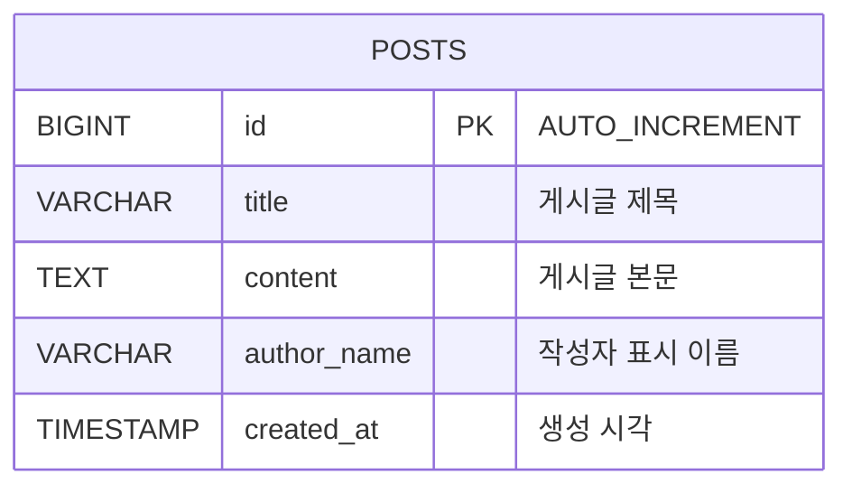

# 012 Cloud DB Migration

## 목표

007번 게시판 DB를 Ubuntu 서버의 MariaDB/MySQL에서 Naver Cloud `Cloud DB for MySQL`로 마이그레이션합니다.

흐름:

```text
Source DB 사전 설정
  -> Cloud DB for MySQL 생성
  -> DMS Endpoint 생성
  -> DMS Migration 실행
  -> 데이터 검증
  -> Backend DB_HOST 전환
```

## ERD



## 데이터 사전

| 컬럼 | 타입 | 설명 |
| --- | --- | --- |
| `id` | `BIGINT` | 게시글 고유 번호 |
| `title` | `VARCHAR(200)` | 게시글 제목 |
| `content` | `TEXT` | 게시글 본문 |
| `author_name` | `VARCHAR(100)` | 작성자 표시 이름 |
| `created_at` | `TIMESTAMP` | 생성 시각 |

## 1. Source DB 준비

```bash
cd "012-cloud db migration/scripts"
sudo SOURCE_DB_ROOT_PASSWORD='DB_ROOT_PASSWORD' \
  MIGRATION_USER='dms_migration' \
  MIGRATION_PASSWORD='ChangeMigrationPassword123!' \
  SOURCE_DATABASE='chapter3_board' \
  ./prepare-source-db.sh
```

확인:

```bash
sudo SOURCE_DB_ROOT_PASSWORD='DB_ROOT_PASSWORD' ./check-source-db.sh
```

## 2. Cloud DB for MySQL 생성

콘솔에서 Target DB를 생성합니다.

```text
VPC
  -> Cloud DB for MySQL
  -> DB Server 생성
```

Source DB와 같은 major version을 권장합니다.

## 3. ACG 확인

Source DB inbound:

| 프로토콜 | 포트 | 접근 소스 |
| --- | --- | --- |
| TCP | `3306` | DMS/Cloud DB에서 Source DB로 접근하는 IP 또는 NAT Gateway IP |

Backend에서 Cloud DB로 전환할 때:

| 방향 | 포트 | 설명 |
| --- | --- | --- |
| Backend outbound | `3306` | Cloud DB 접속 |
| Cloud DB inbound | `3306` | Backend private IP 허용 |

## 4. DMS Endpoint 생성

```text
Database Migration Service
  -> Endpoint Management
  -> Source Endpoint 생성
```

입력값:

| 항목 | 예시 |
| --- | --- |
| Host | Source DB private IP |
| Port | `3306` |
| User | `dms_migration` |
| Password | migration user password |
| Database | `chapter3_board` |

`Test Connection`을 먼저 통과시킵니다.

## 5. Migration 생성

```text
Database Migration Service
  -> Migration Management
  -> Migration 생성
```

Source Endpoint와 Target Cloud DB for MySQL을 선택하고 `chapter3_board`를 이관합니다.

## 6. 데이터 검증

```bash
SOURCE_DB_HOST='SOURCE_DB_PRIVATE_IP' \
SOURCE_DB_USER='chapter3_user' \
SOURCE_DB_PASSWORD='ChangeThisPassword123!' \
TARGET_DB_HOST='db-xxxx.vpc-cdb.ntruss.com' \
TARGET_DB_USER='TARGET_USER' \
TARGET_DB_PASSWORD='TARGET_PASSWORD' \
DB_NAME='chapter3_board' \
./compare-post-counts.sh
```

## 7. 백엔드 전환

```bash
sudo BACKEND_ENV_FILE='/opt/chapter3-backend/.env' \
  DB_HOST='db-xxxx.vpc-cdb.ntruss.com' \
  DB_PORT='3306' \
  DB_USER='TARGET_USER' \
  DB_PASSWORD='TARGET_PASSWORD' \
  DB_NAME='chapter3_board' \
  ./switch-backend-db.sh
```

확인:

```bash
curl http://localhost:4000/api/health
curl http://localhost:4000/api/posts
```

## 참고

- 상세 자료는 저장소의 `012-cloud db migration/README.md`를 확인합니다.
