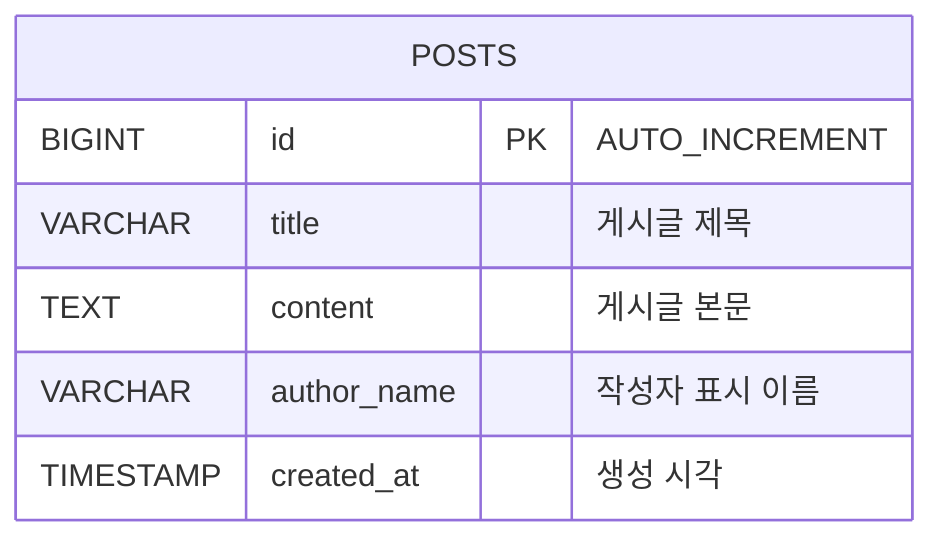

# 015 Cloud DB Migration

## 목표

003번 게시판 DB를 Ubuntu 서버의 MariaDB/MySQL에서 Naver Cloud `Cloud DB for MySQL`로 마이그레이션합니다.

이 실습에서는 두 가지 방식을 소개합니다.

| 방식 | 적합한 상황 | 특징 |
| --- | --- | --- |
| DMS | 운영 DB를 Cloud DB로 이관 | 콘솔 기반, 연결 테스트 제공, binlog/권한/ACG 준비 필요 |
| mysqldump | 작은 DB를 단순 백업/복원 | SQL 파일로 이해하기 쉬움, 덤프 이후 변경분은 자동 반영되지 않음 |

DMS 흐름:

```text
Source DB 사전 설정
  -> Cloud DB for MySQL 생성
  -> DMS Endpoint 생성
  -> DMS Migration 실행
  -> 데이터 검증
  -> Backend DB_HOST 전환
```

mysqldump 흐름:

```text
데이터 변경 중지 또는 점검 시간 확보
  -> mysqldump로 SQL 파일 생성
  -> Cloud DB for MySQL에 복원
  -> 데이터 검증
  -> Backend DB_HOST 전환
```

## ERD



## 데이터 사전

| 컬럼 | 타입 | 설명 |
| --- | --- | --- |
| `id` | `BIGINT` | 게시글 고유 번호 |
| `title` | `VARCHAR(200)` | 게시글 제목 |
| `content` | `TEXT` | 게시글 본문 |
| `author_name` | `VARCHAR(100)` | 작성자 표시 이름 |
| `created_at` | `TIMESTAMP` | 생성 시각 |

## 1. Source DB 준비

Naver Cloud DB for MySQL의 DB 사용자 비밀번호 입력 제한을 피하려고 예시 비밀번호는 2자 이상, 21자 이하인 `MigratePass123!`를 사용합니다.

```bash
cd "015-cloud db migration/scripts"
sudo MIGRATION_USER='dms_migration' \
  MIGRATION_PASSWORD='MigratePass123!' \
  SOURCE_DATABASE='chapter3_board' \
  ./prepare-source-db.sh
```

003번 Ubuntu DB 서버처럼 `root`가 `unix_socket` 인증을 쓰는 경우에는 `SOURCE_DB_ROOT_PASSWORD`를 넣지 않습니다. `sudo mysql` 또는 `sudo mariadb`로 접속되는 구조입니다.

비밀번호 기반 root 접속을 쓰는 경우:

```bash
sudo SOURCE_DB_ADMIN_PASSWORD='DB_ROOT_PASSWORD' \
  MIGRATION_USER='dms_migration' \
  MIGRATION_PASSWORD='MigratePass123!' \
  SOURCE_DATABASE='chapter3_board' \
  ./prepare-source-db.sh
```

확인:

```bash
sudo ./check-source-db.sh
```

`ERROR 1227 ... CREATE USER privilege`가 나오면 관리자 계정이 아니라 일반 앱 계정으로 접속한 것입니다.

## 2. Cloud DB for MySQL 생성

콘솔에서 Target DB를 생성합니다.

```text
VPC
  -> Cloud DB for MySQL
  -> DB Server 생성
```

Source DB와 같은 major version을 권장합니다.

Cloud DB for MySQL은 DB 서버 OS에 접속해서 `root@localhost`로 계정을 만드는 방식이 아닙니다. 콘솔의 `Cloud DB for MySQL > DB Server > Manage DB > Manage DB user`에서 DB User를 생성합니다.

계정 구분:

| 위치 | 계정 | 만드는 방법 |
| --- | --- | --- |
| Source Ubuntu DB | `dms_migration` | `prepare-source-db.sh` |
| Target Cloud DB for MySQL | `TARGET_USER` | Console Manage DB user |

## 3. ACG 확인

Source DB inbound:

| 프로토콜 | 포트 | 접근 소스 |
| --- | --- | --- |
| TCP | `3306` | DMS/Cloud DB에서 Source DB로 접근하는 IP 또는 NAT Gateway IP |

Backend에서 Cloud DB로 전환할 때:

| 방향 | 포트 | 설명 |
| --- | --- | --- |
| Backend outbound | `3306` | Cloud DB 접속 |
| Cloud DB inbound | `3306` | Backend private IP 허용 |

## 4. 방법 A: DMS Endpoint 생성

```text
Database Migration Service
  -> Endpoint Management
  -> Source Endpoint 생성
```

입력값:

| 항목 | 예시 |
| --- | --- |
| Host | Source DB private IP |
| Port | `3306` |
| User | `dms_migration` |
| Password | migration user password |
| Database | `chapter3_board` |

`Test Connection`을 먼저 통과시킵니다.

## 5. 방법 A: Migration 생성

```text
Database Migration Service
  -> Migration Management
  -> Migration 생성
```

Source Endpoint와 Target Cloud DB for MySQL을 선택하고 `chapter3_board`를 이관합니다.

## 6. 방법 B: mysqldump 이관

정확한 이관을 위해 덤프 중에는 게시판 백엔드와 자동 게시글 생성을 잠시 멈춥니다.

```bash
sudo systemctl stop chapter3-post-seeder || true
sudo systemctl stop chapter3-backend
```

Source DB에서 덤프 파일 생성:

```bash
cd "015-cloud db migration/scripts"

SOURCE_DB_HOST='SOURCE_DB_PRIVATE_IP' \
SOURCE_DB_USER='chapter3_user' \
SOURCE_DB_PASSWORD='AppDbPass123!' \
DB_NAME='chapter3_board' \
DUMP_FILE='/tmp/chapter3_board.sql' \
./dump-source-db.sh
```

Cloud DB for MySQL에 복원:

```bash
TARGET_DB_HOST='db-xxxx.vpc-cdb.ntruss.com' \
TARGET_DB_USER='TARGET_USER' \
TARGET_DB_PASSWORD='TARGET_PASSWORD' \
DUMP_FILE='/tmp/chapter3_board.sql' \
./restore-target-db.sh
```

명령어를 직접 쓰면 아래와 같습니다.

```bash
MYSQL_PWD='SOURCE_PASSWORD' mysqldump \
  -h SOURCE_DB_PRIVATE_IP \
  -u chapter3_user \
  --single-transaction \
  --quick \
  --routines \
  --triggers \
  --events \
  --default-character-set=utf8mb4 \
  --databases chapter3_board \
  > /tmp/chapter3_board.sql
```

```bash
MYSQL_PWD='TARGET_PASSWORD' mysql \
  -h db-xxxx.vpc-cdb.ntruss.com \
  -u TARGET_USER \
  < /tmp/chapter3_board.sql
```

## 7. 데이터 검증

```bash
SOURCE_DB_HOST='SOURCE_DB_PRIVATE_IP' \
SOURCE_DB_USER='chapter3_user' \
SOURCE_DB_PASSWORD='AppDbPass123!' \
TARGET_DB_HOST='db-xxxx.vpc-cdb.ntruss.com' \
TARGET_DB_USER='TARGET_USER' \
TARGET_DB_PASSWORD='TARGET_PASSWORD' \
DB_NAME='chapter3_board' \
./compare-post-counts.sh
```

## 8. 백엔드 전환

```bash
sudo BACKEND_ENV_FILE='/opt/chapter3-backend/.env' \
  DB_HOST='db-xxxx.vpc-cdb.ntruss.com' \
  DB_PORT='3306' \
  DB_USER='TARGET_USER' \
  DB_PASSWORD='TARGET_PASSWORD' \
  DB_NAME='chapter3_board' \
  ./switch-backend-db.sh
```

확인:

```bash
curl http://localhost:4000/api/health
curl http://localhost:4000/api/posts
```

## 참고

- 상세 자료는 저장소의 `015-cloud db migration/README.md`를 확인합니다.
