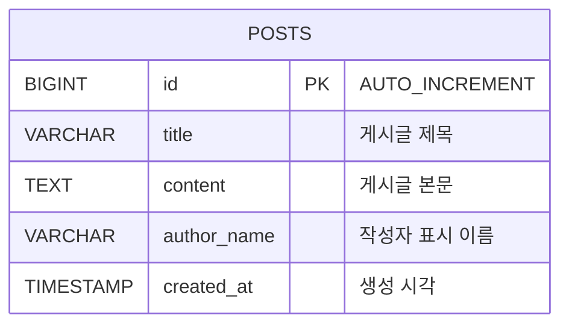

# 017 Cloud DB Migration

## 목표

003번 게시판 DB를 Ubuntu 서버의 MariaDB/MySQL에서 Naver Cloud `Cloud DB for MySQL`로 마이그레이션합니다.

!!! warning "015 Cloud DB 재사용"
    이 실습은 추가 Cloud DB를 만들지 않고 015에서 생성한 Cloud DB를 Target으로 재사용합니다. DMS 시작 전 Backend와 자동 게시글 서비스를 중지하고 Target의 `board_service`를 삭제합니다. 015에서 Target에 작성한 데이터는 삭제되지만, 마이그레이션할 003 Source DB의 데이터는 그대로 유지됩니다.

이 실습에서는 두 가지 방식을 소개합니다.

| 방식 | 적합한 상황 | 특징 |
| --- | --- | --- |
| DMS | 운영 DB를 Cloud DB로 이관 | 콘솔 기반, 연결 테스트 제공, binlog/권한/ACG 준비 필요 |
| mysqldump | 작은 DB를 단순 백업/복원 | SQL 파일로 이해하기 쉬움, 덤프 이후 변경분은 자동 반영되지 않음 |

DMS 흐름:

```text
Source DB 사전 설정
  -> Backend 쓰기 중지
  -> 015 Cloud DB의 board_service 삭제
  -> DMS Endpoint 생성
  -> DMS Migration 실행
  -> 데이터 검증
  -> Backend DB_HOST 전환
```

mysqldump 흐름:

```text
데이터 변경 중지 또는 점검 시간 확보
  -> mysqldump로 SQL 파일 생성
  -> Cloud DB for MySQL에 복원
  -> 데이터 검증
  -> Backend DB_HOST 전환
```

## ERD



## 데이터 사전

| 컬럼 | 타입 | 설명 |
| --- | --- | --- |
| `id` | `BIGINT` | 게시글 고유 번호 |
| `title` | `VARCHAR(200)` | 게시글 제목 |
| `content` | `TEXT` | 게시글 본문 |
| `author_name` | `VARCHAR(100)` | 작성자 표시 이름 |
| `created_at` | `TIMESTAMP` | 생성 시각 |

## 1. Source DB 준비

Naver Cloud DB for MySQL의 DB 사용자 비밀번호 조건에 맞춰 예시 비밀번호는 8자 이상, 20자 이하인 `MigratePass123!`를 사용합니다.

!!! important "어느 서버에서 어떤 계정으로 실행하는가"
    이 단계는 Backend 서버에서 DB에 원격 접속해 실행하는 작업이 아닙니다. MariaDB 설정 파일과 서비스를 변경해야 하므로 Bastion에서 **003 Source DB 서버의 Private IP로 SSH 접속**한 뒤 실행합니다.

    | 구분 | 사용할 계정 | 비밀번호 | 용도 |
    | --- | --- | --- | --- |
    | Source DB 서버 SSH | OS `root` | 서버 관리자 비밀번호 | 설정 파일 및 MariaDB 서비스 변경 |
    | Source MariaDB 로그인 | DB `root` | 003 DB `.env`의 `DB_ROOT_PASSWORD` | DMS 계정 생성 및 권한 부여 |
    | Source 애플리케이션 계정 | `board_app` | `DB_PASSWORD` | Backend 전용이며 Source 준비에는 사용하지 않음 |
    | DMS 전용 계정 | `dms_migration` | `MigratePass123!` | 생성 후 DMS Source Endpoint에 입력 |

    ```bash
    # Bastion 서버에서 실행
    ssh root@SOURCE_DB_PRIVATE_IP

    # Source DB 서버에서 MariaDB 관리자 비밀번호 위치 확인
    cd ~/cloud-infrastructure-lecture-example/"003-three tier web app"/db
    grep '^DB_ROOT_PASSWORD=' .env
    ```

### 1-1. MariaDB 바이너리 로그 설정

003번 Source DB 서버에서 DMS가 초기 데이터 이후의 변경분을 읽을 수 있도록 바이너리 로그를 활성화합니다.

```bash
sudo tee /etc/mysql/mariadb.conf.d/60-dms-source.cnf >/dev/null <<'EOF'
[mysqld]
server-id=1
log_bin=mysql-bin
binlog_format=ROW
binlog_row_image=FULL
expire_logs_days=7
bind-address=0.0.0.0
EOF

sudo systemctl restart mariadb
sudo systemctl is-active mariadb
```

각 설정은 다음 역할을 합니다.

| 설정 | 실습값 | 의미와 DMS에 필요한 이유 | 잘못 설정했을 때 |
| --- | --- | --- | --- |
| `server-id` | `1` | 바이너리 로그 이벤트를 만든 DB 서버를 식별하는 고유 번호입니다. 이 실습은 Source가 하나이므로 `1`을 사용하며, 복제 구성에 서버가 여러 대면 서로 다른 값을 사용해야 합니다. | 미지정 또는 중복 값은 복제 이벤트의 출처 식별을 방해합니다. |
| `log_bin` | `mysql-bin` | 변경 이력을 `mysql-bin.000001` 같은 바이너리 로그 파일에 기록하도록 활성화하고 파일 이름 접두어를 지정합니다. DMS는 초기 백업을 복구한 뒤 이 로그를 읽어 이후의 `INSERT`·`UPDATE`·`DELETE`를 Target에 반영합니다. | 실행 값이 `OFF`면 변경분 동기화를 시작할 수 없습니다. |
| `binlog_format` | `ROW` | 실행한 SQL 문장보다 실제로 바뀐 각 행의 값을 기록합니다. `NOW()`나 `UUID()` 같은 함수가 Target에서 다르게 계산되는 문제를 피하고 DMS가 행 변경을 확정적으로 재현하게 합니다. | `STATEMENT`는 SQL 재실행 결과가 Source와 달라질 수 있고, `MIXED`는 이벤트 형식이 섞입니다. |
| `binlog_row_image` | `FULL` | `ROW` 이벤트에 변경 전·후 행의 모든 컬럼을 담습니다. DMS가 스키마를 별도로 추정하지 않고 `UPDATE`와 `DELETE`를 해석하기 쉬운 형식입니다. | `MINIMAL`보다 로그 용량은 커지지만, 가변적인 컬럼 구성을 DMS가 해석해야 하는 부담을 줄입니다. |
| `expire_logs_days` | `7` | 7일이 지난 바이너리 로그를 자동 정리해 디스크 고갈을 방지합니다. NAVER Cloud DMS의 5일 초과 보존 권장을 따른 실습값입니다. | DMS 지연 시간보다 보존 기간이 짧으면 필요한 이전 로그가 삭제되어 복제가 끊기고, 설정 변경 후 Migration을 새로 만들어야 합니다. |
| `bind-address` | `0.0.0.0` | MariaDB가 Loopback만이 아니라 서버의 네트워크 인터페이스에서도 `3306/tcp` 연결을 받게 합니다. Target Cloud DB가 Source에 접속하려면 필요합니다. | `127.0.0.1`이면 원격 DMS 연결이 거절됩니다. `0.0.0.0`은 모든 인터페이스에서 듣는다는 뜻이므로 ACG와 DB User Host를 Target 서브넷으로 제한해야 합니다. |

마지막 결과가 `active`인지 확인합니다.

### 1-2. DMS 전용 계정 생성

MariaDB 관리자 비밀번호는 003 DB 서버의 `~/cloud-infrastructure-lecture-example/003-three tier web app/db/.env`에 있는 `DB_ROOT_PASSWORD`를 입력합니다. 이 실습의 Target Cloud DB Subnet이 `10.10.120.0/24`이므로 MariaDB 계정의 Host는 MySQL 대역 표기인 `10.10.120.%`를 사용합니다.

```bash
sudo mariadb -u root -p <<'SQL'
CREATE USER IF NOT EXISTS 'dms_migration'@'10.10.120.%'
  IDENTIFIED VIA mysql_native_password USING PASSWORD('MigratePass123!');
ALTER USER 'dms_migration'@'10.10.120.%'
  IDENTIFIED VIA mysql_native_password USING PASSWORD('MigratePass123!');
GRANT RELOAD, PROCESS, SHOW DATABASES, REPLICATION SLAVE, REPLICATION CLIENT
  ON *.* TO 'dms_migration'@'10.10.120.%';
GRANT SELECT ON mysql.* TO 'dms_migration'@'10.10.120.%';
GRANT SELECT, SHOW VIEW, LOCK TABLES, TRIGGER
  ON board_service.* TO 'dms_migration'@'10.10.120.%';
FLUSH PRIVILEGES;
SQL
```

권한은 적용 범위와 용도가 다릅니다.

| 인증/권한 | 범위 | DMS에서의 역할 |
| --- | --- | --- |
| `mysql_native_password` | 계정 인증 | DMS Source Endpoint가 사용할 암호 인증 방식입니다. 권한이 충분해도 인증 방식이 맞지 않으면 연결 테스트가 실패할 수 있습니다. |
| `RELOAD` | `*.*` 전역 | GTID를 사용하지 않는 Source에서 초기 백업의 일관된 기준 시점을 만들 때 필요한 `FLUSH` 계열 작업을 허용합니다. |
| `PROCESS` | `*.*` 전역 | 백업 도구가 서버 실행 상태와 세션 정보를 확인하는 데 사용하는 DMS 최소 권한입니다. |
| `SHOW DATABASES` | `*.*` 전역 | Source에 있는 DB 목록을 조회해 Migration 대상을 탐색하게 합니다. |
| `REPLICATION SLAVE` | `*.*` 전역 | DMS가 Source에 복제 클라이언트로 접속해 binlog 이벤트 스트림을 읽게 합니다. MariaDB의 기존 권한명으로, 최근 용어의 Replica와 같은 의미입니다. |
| `REPLICATION CLIENT` | `*.*` 전역 | `SHOW MASTER STATUS`와 바이너리 로그 목록을 조회해 현재 File/Position을 확인하게 합니다. MariaDB 10.5 이상의 `SHOW GRANTS`에서는 별칭인 `BINLOG MONITOR`로 표시될 수 있습니다. |
| `SELECT ON mysql.*` | `mysql` 시스템 DB | 계정·권한·메타데이터를 조회합니다. NAVER Cloud DMS의 `시스템 테이블 권한=Y`에 해당합니다. |
| `SELECT` | `board_service.*` | 초기 전체 적재에서 게시판 테이블의 스키마와 행 데이터를 읽습니다. |
| `SHOW VIEW` | `board_service.*` | View가 있는 경우 정의문을 조회해 Target에 재생성하게 합니다. |
| `LOCK TABLES` | `board_service.*` | `mysqldump` 백업 구간에서 테이블을 일관된 시점으로 읽도록 명시적 Lock을 허용합니다. |
| `TRIGGER` | `board_service.*` | Trigger 정의를 백업·복원 대상으로 조회하게 합니다. 현재 게시판에 Trigger가 없어도 DMS 표준 최소 권한으로 미리 부여합니다. |

`*.*`는 서버 전체에 적용되는 전역 권한이고, `board_service.*`는 게시판 DB 내부로 제한된 권한입니다. `FLUSH PRIVILEGES` 후에도 DMS와 기존 연결은 새 세션으로 다시 연결하여 변경된 전역 권한을 적용받도록 합니다.

`ERROR 1227 ... CREATE USER privilege`가 나오면 `board_app` 같은 일반 앱 계정으로 접속한 것입니다. 반드시 MariaDB `root` 관리자 계정으로 실행합니다.

### 1-3. Source DB 준비 상태 확인

```bash
sudo mariadb -u root -p board_service <<'SQL'
SHOW VARIABLES
WHERE Variable_name IN (
  'server_id', 'log_bin', 'binlog_format',
  'binlog_row_image', 'expire_logs_days', 'bind_address'
);
SHOW MASTER STATUS;
SHOW GRANTS FOR 'dms_migration'@'10.10.120.%';
SELECT COUNT(*) AS total_posts FROM posts;
SQL
```

다음 기준을 하나씩 확인합니다.

| 확인 항목 | 통과 기준 | 출력을 읽는 방법 |
| --- | --- | --- |
| `server_id` | `1` 등 `0`이 아닌 고유값 | Source가 binlog 이벤트의 출처 서버로 식별될 수 있음을 뜻합니다. |
| `log_bin` | `ON` | 설정 파일의 `mysql-bin`은 파일 접두어이고, `SHOW VARIABLES`의 `ON`이 실제 활성화 여부입니다. |
| `binlog_format` | `ROW` | SQL 문장이 아닌 행 변경 기반으로 적재되었음을 뜻합니다. |
| `binlog_row_image` | `FULL` | 변경 전·후의 모든 컬럼이 기록되는 형식입니다. |
| `expire_logs_days` | `7.000000` 등 `5`보다 큰 값 | DMS가 지연되어도 추적할 binlog 보존 여유가 있습니다. |
| `bind_address` | `0.0.0.0` | MariaDB가 원격 TCP 접속을 듣고 있습니다. 실제 허용 대상은 ACG와 `dms_migration@10.10.120.%`가 제한합니다. |
| `SHOW MASTER STATUS` | 한 행 이상 | `File`은 현재 binlog 파일, `Position`은 다음 이벤트가 기록될 바이트 위치입니다. DMS가 초기 백업 후 변경분을 어디서부터 읽을지 판별하는 좌표입니다. |
| `SHOW GRANTS` | 전역·`mysql.*`·`board_service.*` 권한 모두 표시 | 복제 권한만이 아니라 시스템 메타데이터와 실제 게시판 데이터를 읽을 수 있어야 합니다. |
| `total_posts` | `0` 이상의 숫자 | 이값은 성공 조건이라기보다 Migration 전 기준 행 수입니다. 마이그레이션 후 Target의 값과 비교합니다. |

`SHOW MASTER STATUS`가 빈 결과이면 binlog가 아직 활성화되지 않은 것이므로 다음 단계로 넘어가지 않습니다. `Binlog_Do_DB`와 `Binlog_Ignore_DB`가 비어 있는 것은 서버 수준의 DB 필터를 걸지 않았다는 뜻이며, 이 실습의 `board_service` 선택은 DMS Migration 작업에서 지정합니다.

!!! note "공식 기준"
    NAVER Cloud DMS의 Source DB 요구 사항은 [Source DB 및 Target DB 접속 설정](https://guide.ncloud-docs.com/docs/dms-connect), 각 binlog 형식의 차이는 [MariaDB Binary Log Formats](https://mariadb.com/docs/server/server-management/server-monitoring-logs/binary-log/binary-log-formats)에서 확인할 수 있습니다.

## 2. 015 Cloud DB Target 초기화

015에서 Backend가 Target의 `board_service`를 계속 사용하면 데이터베이스를 삭제할 수 없고 DMS 데이터와 기존 쓰기가 섞일 수 있습니다. **Backend 서버**에서 먼저 두 서비스를 중지합니다.

```bash
sudo systemctl stop board-service-post-seeder || true
sudo systemctl stop board-service-backend
```

Cloud DB 콘솔에서 다음 순서로 `board_service` 데이터베이스만 삭제합니다. Cloud DB 서버와 DB User는 삭제하지 않습니다.

```text
Cloud DB for MySQL
  -> DB Server
  -> 015에서 만든 board-mysql 선택
  -> DB 관리
  -> Database 관리
  -> board_service 행의 삭제
```

삭제 작업이 끝나고 Cloud DB 상태가 다시 `운영중`이 될 때까지 기다립니다. Backend 서버에서 아래 명령을 실행했을 때 결과가 출력되지 않으면 DMS Target 준비가 완료된 것입니다.

```bash
MYSQL_PWD='BoardAdmin123!' mysql \
  -h db-xxxx.vpc-cdb.ntruss.com \
  -u board_admin \
  -Nse "SELECT SCHEMA_NAME FROM information_schema.SCHEMATA WHERE SCHEMA_NAME='board_service';"
```

Cloud DB for MySQL은 DB 서버 OS에 접속해서 `root@localhost`로 계정을 만드는 방식이 아닙니다. 콘솔의 `Cloud DB for MySQL > DB Server > Manage DB > Manage DB user`에서 DB User를 생성합니다.

015에서 생성한 다음 DB User는 삭제하지 않고 그대로 사용합니다. 없거나 설정이 다를 때만 **DB 관리 > DB User 관리**에서 추가하거나 수정합니다.

| USER_ID | HOST(IP) | DB 권한 | 암호 예시 | 용도 |
| --- | --- | --- | --- | --- |
| `board_admin` | Backend Subnet 예: `10.10.110.%` | `DDL` | `BoardAdmin123!` | mysqldump 복원, 스키마 및 검증 작업 |
| `board_app` | Backend Subnet 예: `10.10.110.%` | `CRUD` | `BoardApp123!` | 마이그레이션 완료 후 Backend 연결 |

두 계정 모두 **시스템 테이블은 선택하지 않습니다**. `DDL`은 `CRUD`와 `READ`를 포함하고 테이블 생성·변경·삭제가 가능하며, `CRUD`는 게시글 조회·등록·수정·삭제에 사용합니다. DMS 작업 생성 화면에서는 별도 Target DB User를 입력하지 않고 생성한 Cloud DB Service를 Target으로 선택합니다.

계정 구분:

| 위치 | 계정 | 만드는 방법 |
| --- | --- | --- |
| Source Ubuntu DB | `dms_migration` | 위 MariaDB SQL로 생성, DMS Endpoint에서 사용 |
| Target Cloud DB for MySQL | `board_admin` | Console Manage DB user에서 `DDL`로 생성 |
| Target Cloud DB for MySQL | `board_app` | Console Manage DB user에서 `CRUD`로 생성 |

## 3. ACG 확인

이 실습처럼 Source DB와 Target Cloud DB가 같은 VPC에 있으면 별도의 `DMS 접근 주소`를 찾지 않습니다. DMS 마이그레이션 과정에서는 **Target Cloud DB가 Source DB의 3306 포트로 접속**하므로 Target Cloud DB가 속한 Subnet 대역을 허용합니다.

콘솔의 **Cloud DB for MySQL > DB Server**에서 Target DB의 Subnet을 확인한 다음, **VPC > Subnet**에서 그 Subnet의 IP 주소 범위(CIDR)를 확인합니다. 이 실습에서는 해당 값이 `10.10.120.0/24`입니다.

Source DB 서버에 적용된 ACG의 **Inbound** 규칙:

| 프로토콜 | 포트 | 접근 소스 |
| --- | --- | --- |
| TCP | `3306` | Target Cloud DB Subnet CIDR: `10.10.120.0/24` |

Target Cloud DB에 적용된 ACG의 **Outbound** 규칙:

| 프로토콜 | 포트 | 목적지 |
| --- | --- | --- |
| TCP | `3306` | Source DB Private IP `/32` 또는 Source DB Subnet CIDR |

예를 들어 Source DB Private IP가 `10.10.120.7`이면 목적지를 `10.10.120.7/32`로 입력합니다. Source DB ACG의 접근 소스, Target Cloud DB ACG의 목적지, `dms_migration` 계정 Host가 모두 맞아야 DMS의 `Test Connection`이 성공합니다.

!!! note "NAT Gateway IP는 언제 사용하는가"
    Source DB와 Target Cloud DB가 같은 VPC에서 사설 통신하는 이번 실습에는 NAT Gateway IP를 입력하지 않습니다. 서로 다른 네트워크를 공인 경로로 연결할 때만 Target 측 NAT Gateway의 공인 IP를 Source DB ACG와 DB 계정 Host에 허용합니다.

Backend에서 Cloud DB로 전환할 때:

| 방향 | 포트 | 설명 |
| --- | --- | --- |
| 관리 서버 outbound / Cloud DB inbound | `3306` | `board_admin`으로 mysqldump 복원 및 검증 |
| Backend outbound | `3306` | Cloud DB 접속 |
| Cloud DB inbound | `3306` | Backend private IP 허용 |

## 4. 방법 A: DMS Endpoint 생성

```text
Database Migration Service
  -> Endpoint Management
  -> Source Endpoint 생성
```

입력값:

| 항목 | 예시 |
| --- | --- |
| Host | Source DB private IP |
| Port | `3306` |
| User | `dms_migration` |
| Password | migration user password |
| Database | `board_service` |

`Test Connection`을 먼저 통과시킵니다.

## 5. 방법 A: Migration 생성

```text
Database Migration Service
  -> Migration Management
  -> Migration 생성
```

Source Endpoint와 Target Cloud DB for MySQL을 선택하고 `board_service`를 이관합니다.

## 6. 방법 B: mysqldump 이관

정확한 이관을 위해 덤프 중에는 게시판 백엔드와 자동 게시글 생성을 잠시 멈춥니다.

```bash
sudo systemctl stop board-service-post-seeder || true
sudo systemctl stop board-service-backend
```

Source DB에서 덤프 파일 생성:

```bash
cd "017-cloud db migration/scripts"

SOURCE_DB_HOST='SOURCE_DB_PRIVATE_IP' \
SOURCE_DB_USER='board_app' \
SOURCE_DB_PASSWORD='BoardApp123!' \
DB_NAME='board_service' \
DUMP_FILE='/tmp/board_service.sql' \
./dump-source-db.sh
```

Cloud DB for MySQL에 복원:

```bash
TARGET_DB_HOST='db-xxxx.vpc-cdb.ntruss.com' \
TARGET_DB_USER='board_admin' \
TARGET_DB_PASSWORD='BoardAdmin123!' \
DUMP_FILE='/tmp/board_service.sql' \
./restore-target-db.sh
```

명령어를 직접 쓰면 아래와 같습니다.

```bash
MYSQL_PWD='SOURCE_PASSWORD' mysqldump \
  -h SOURCE_DB_PRIVATE_IP \
  -u board_app \
  --single-transaction \
  --quick \
  --routines \
  --triggers \
  --events \
  --default-character-set=utf8mb4 \
  --databases board_service \
  > /tmp/board_service.sql
```

```bash
MYSQL_PWD='BoardAdmin123!' mysql \
  -h db-xxxx.vpc-cdb.ntruss.com \
  -u board_admin \
  < /tmp/board_service.sql
```

## 7. 데이터 검증

```bash
SOURCE_DB_HOST='SOURCE_DB_PRIVATE_IP' \
SOURCE_DB_USER='board_app' \
SOURCE_DB_PASSWORD='BoardApp123!' \
TARGET_DB_HOST='db-xxxx.vpc-cdb.ntruss.com' \
TARGET_DB_USER='board_app' \
TARGET_DB_PASSWORD='BoardApp123!' \
DB_NAME='board_service' \
./compare-post-counts.sh
```

## 8. 백엔드 전환

```bash
sudo BACKEND_ENV_FILE='/opt/board-service-backend/.env' \
  DB_HOST='db-xxxx.vpc-cdb.ntruss.com' \
  DB_PORT='3306' \
  DB_USER='board_app' \
  DB_PASSWORD='BoardApp123!' \
  DB_NAME='board_service' \
  ./switch-backend-db.sh
```

확인:

```bash
curl http://localhost:4000/api/health
curl http://localhost:4000/api/posts
```

## 참고

- 상세 자료는 저장소의 `017-cloud db migration/README.md`를 확인합니다.
