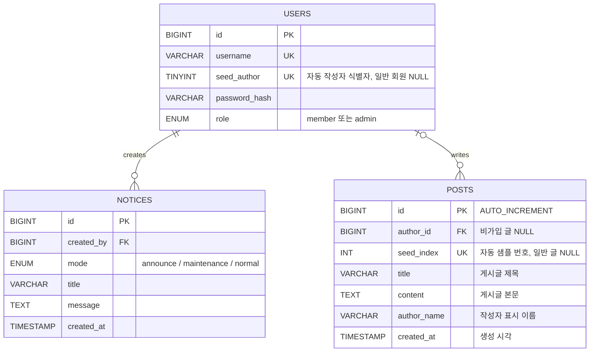

# 402 Cloud DB Migration

## 목표

003번 게시판 DB를 Ubuntu 서버의 MariaDB/MySQL에서 Naver Cloud `Cloud DB for MySQL`로 마이그레이션합니다.

**401 생성·연결 → 402 마이그레이션 → 403 백업·복구** 순서로 진행합니다. 이관이 끝나면 같은 Cloud DB의 `board_service`를 403에서 백업·복구 대상으로 사용합니다.

!!! warning "401 Cloud DB 재사용"
    이 실습은 추가 Cloud DB를 만들지 않고 401에서 생성한 Cloud DB를 Target으로 재사용합니다. DMS 시작 전 Backend와 자동 게시글 서비스를 중지하고 Target의 `board_service`를 삭제합니다. 401에서 Target에 작성한 데이터가 필요하면 삭제 전에 내보내거나 백업을 확보합니다. 마이그레이션할 003 Source DB의 데이터는 그대로 유지됩니다.

| 구분 | Subnet | CIDR/주소 | 역할 |
| --- | --- | --- | --- |
| 003 Source Ubuntu DB | `lab7-sub-pri-kr2` | `10.10.120.0/24` 내 DB Private IP | 원본 MariaDB |
| 401 Target Cloud DB | `lab7-sub-pri-kr1` | `10.10.110.0/24` | 마이그레이션 목적지 |
| Source의 DMS 계정 Host | - | `10.10.110.%` | Target Cloud DB Subnet에서 오는 DB 로그인 허용 |

이 실습에서는 두 가지 방식을 소개합니다.

| 방식 | 적합한 상황 | 특징 |
| --- | --- | --- |
| DMS | 운영 DB를 Cloud DB로 이관 | 콘솔 기반, 연결 테스트 제공, binlog/권한/ACG 준비 필요 |
| mysqldump | 작은 DB를 단순 백업/복원 | SQL 파일로 이해하기 쉬움, 덤프 이후 변경분은 자동 반영되지 않음 |

DMS 흐름:

```text
Source DB 사전 설정
  -> Backend 쓰기 중지
  -> 401 Cloud DB의 board_service 삭제
  -> DMS Endpoint 생성
  -> DMS Migration 실행
  -> 데이터 검증
  -> Backend DB_HOST 전환
```

mysqldump 흐름:

```text
데이터 변경 중지 또는 점검 시간 확보
  -> mysqldump로 SQL 파일 생성
  -> Cloud DB for MySQL에 복원
  -> 데이터 검증
  -> Backend DB_HOST 전환
```

## ERD




| 이관 테이블 | 내용 | 확인 사항 |
| --- | --- | --- |
| `posts` | 기존 게시글 | `author_id → users.id`, `seed_index` 포함 |
| `users` | 회원·관리자 계정 | `role`, `password_hash`, `session_version`, `seed_author` 포함 |
| `notices` | 관리자 공지 이력 | `created_by → users.id` 외래 키 유지 |

회원·관리자는 `users.role`로 구분합니다. 이 계정은 애플리케이션 데이터이므로 DMS로 이관됩니다. MySQL 접속 계정인 `board_admin`·`board_app`은 별도로 Target에 설정합니다. Web 공지 캐시와 Backend 세션 서명 파일·자동 작성 진행 파일은 서버 파일이므로 DMS 대상이 아닙니다. 자동 생성 회원과 게시글의 연결·중복 방지 키는 세 테이블과 함께 이관합니다.

## 데이터 사전

`posts` 컬럼:

| 컬럼 | 타입 | 설명 |
| --- | --- | --- |
| `id` | `BIGINT` | 게시글 고유 번호 |
| `title` | `VARCHAR(200)` | 게시글 제목 |
| `content` | `TEXT` | 게시글 본문 |
| `author_name` | `VARCHAR(100)` | 작성자 표시 이름 |
| `created_at` | `TIMESTAMP` | 생성 시각 |

## 0. 시작 전 공지와 점검 화면 준비

502 기본 구성에서 설치 설정 파일은 `/opt/lab7-setup/web/.env`, `/opt/lab7-setup/backend/.env`, `/opt/lab7-setup/db/.env`에 있습니다. `name_prefix`를 바꿨다면 경로의 `lab7`도 바꿉니다.

실습 관리자 계정은 **아이디 `admin` / 비밀번호 `admin`**입니다. 이번 실습의 사전 공지와 점검 안내는 **게시판의 관리자 화면**에서 작성합니다. 공지 이력은 DB에 저장되고 표시용 공지는 Web 서버에 보관되므로 DB나 Backend가 중단되어도 마지막 안내가 표시됩니다.

DB 또는 Backend를 중지하면 관리자 로그인과 공지 작성도 사용할 수 없습니다. 반드시 작업을 시작하기 전에 아래 공지를 등록하고 **화면 반영 완료**까지 확인합니다.

### 0-1. 복사해서 사용할 사전 공지

1. 브라우저에서 게시판의 Web 또는 ALB 주소를 엽니다.
2. 우측 상단 **관리자 로그인**을 누르고 아이디와 비밀번호에 모두 `admin`을 입력한 뒤 **로그인**합니다.
3. **공지 관리** 화면에서 표시 방식을 **사전 공지 · 게시글 최상단 고정**로 선택합니다. 이미 로그인했다면 우측 상단 **공지 관리**를 누릅니다.
4. 아래 제목과 본문을 각각 **공지 제목**, **공지 내용**에 복사해 넣습니다. 점검 일시는 실제 작업 일정으로 바꿉니다.

**공지 제목**

```text
데이터베이스 이전 작업 사전 안내
```

**공지 내용**

```text
안녕하세요. 안정적인 서비스 제공을 위해 데이터베이스 이전 작업을 진행할 예정입니다.

- 점검 일시 : 2026년 00월 00일 18:00 ~ 19:00 (1시간)
- 점검 내용 : DB 마이그레이션 작업
- 고객센터 : 02-1234-1234

작업이 시작되면 게시글 조회·작성·삭제와 회원 가입·로그인이 일시적으로 중단됩니다.
작성 중인 내용은 작업 시작 전에 별도로 보관해 주세요.

작업 완료와 데이터 확인을 마친 뒤 서비스를 다시 열겠습니다.
이용에 불편을 드려 죄송합니다. 양해 부탁드립니다.
```

입력을 마치면 **공지 반영**을 누릅니다. **공지 반영이 완료되었습니다.**라는 메시지를 확인한 뒤 관리 창을 닫고, 게시글 목록 첫 줄에 빨간색 **공지** 표시와 제목이 보이는지 확인합니다. 제목을 누르면 공지 본문이 열립니다. 이 단계에서는 게시판을 계속 이용할 수 있습니다.

### 0-2. 서비스 중단 직전에 점검 모드 켜기

Source MariaDB를 재시작해야 한다면 재시작 전, 그렇지 않다면 [2. Target 초기화](#2-401-cloud-db-target) 전에 아래 절차를 진행합니다.

1. `admin`으로 로그인한 상태에서 우측 상단 **공지 관리**를 엽니다.
2. 표시 방식을 **점검 시작 · 게시판 이용 중단**으로 바꿉니다.
3. 아래 제목과 본문을 **공지 제목**, **공지 내용**에 넣습니다. 점검 일시는 사전 공지에서 안내한 일정과 맞춥니다.

**공지 제목**

```text
데이터베이스 이전 작업 중입니다
```

**공지 내용**

```text
현재 데이터베이스 이전 작업으로 게시판 이용이 일시 중단되었습니다.

- 점검 일시 : 2026년 00월 00일 18:00 ~ 19:00 (1시간)
- 점검 내용 : DB 마이그레이션 작업
- 고객센터 : 02-1234-1234

게시글 조회·작성·삭제와 회원 가입·로그인은 작업 완료 후 다시 이용하실 수 있습니다.
데이터 확인을 마치는 대로 서비스를 정상화하겠습니다.
잠시만 기다려 주세요. 이용에 불편을 드려 죄송합니다.
```

**공지 반영**을 누르고 점검 시작 확인 창에서 **확인**을 선택합니다. **공지 반영이 완료되었습니다.**라는 메시지를 확인한 뒤 관리 창을 닫아 실제 점검 화면이 표시되는지 확인합니다. 반영이 확인되지 않았다면 DB 작업을 시작하지 않습니다.

점검 모드는 일반 공개 `/api/` 요청을 HTTP 503으로 차단하고 모든 게시판 경로에 점검 화면을 표시합니다. ALB 확인 경로 `/healthz`는 HTTP 200을 유지합니다. `/api/auth/`·`/api/admin/`는 복구용으로 Backend에 전달되므로 **Backend 중지 전에는 회원 가입·관리자 쓰기도 가능합니다.** **Backend 내부에서 실행되는 자동 작성기는 Web을 거치지 않으므로 아래처럼 별도로 중지해야 합니다.**

```bash
# Backend 서버에서 실행
sudo systemctl stop board-service-post-seeder board-service-backend
```

이 두 서비스를 중지한 뒤부터 데이터 이관이 끝날 때까지 Source와 Target에 앱의 쓰기를 재개하지 않습니다. 계획된 점검은 DB 연결이 회복되어도 자동으로 해제되지 않습니다. 점검 모드를 켜지 않은 상태에서 DB 또는 Backend 연결 장애가 발생하면 별도의 일시적 장애 안내가 자동 표시됩니다.

## 1. Source DB 준비

Naver Cloud DB for MySQL의 DB 사용자 비밀번호 조건에 맞춰 예시 비밀번호는 8자 이상, 20자 이하인 `MigratePass123!`를 사용합니다.

!!! important "어느 서버에서 어떤 계정으로 실행하는가"
    이 단계는 Backend 서버에서 DB에 원격 접속해 실행하는 작업이 아닙니다. MariaDB 설정 파일과 서비스를 변경해야 하므로 Bastion에서 **003 Source DB 서버의 Private IP로 SSH 접속**한 뒤 실행합니다.

    | 구분 | 사용할 계정 | 비밀번호 | 용도 |
    | --- | --- | --- | --- |
    | Source DB 서버 SSH | OS `root` | 서버 관리자 비밀번호 | 설정 파일 및 MariaDB 서비스 변경 |
    | Source MariaDB 로그인 | DB `root` | 003 DB `.env`의 `DB_ROOT_PASSWORD` | DMS 계정 생성 및 권한 부여 |
    | Source 애플리케이션 계정 | `board_app` | `DB_PASSWORD` | Backend 전용이며 Source 준비에는 사용하지 않음 |
    | DMS 전용 계정 | `dms_migration` | `MigratePass123!` | 생성 후 DMS Source Endpoint에 입력 |

    ```bash
    # Bastion 서버에서 실행
    ssh root@SOURCE_DB_PRIVATE_IP

    # Source DB 서버에서 MariaDB 관리자 비밀번호 위치 확인
    cd ~/cloud-infrastructure-lecture-example/"003-three tier web app"/db
    grep '^DB_ROOT_PASSWORD=' .env
    ```

### 1-1. MariaDB 바이너리 로그 설정

이 단계는 **DMS 방식의 변경분 복제에 필요한 Source 설정**입니다. [NAVER Cloud 공식 문서 — Source DB 및 Target DB 접속 설정](https://guide.ncloud-docs.com/docs/dms-connect)의 **「마이그레이션을 위해 필요한 MySQL 설정」** 절은 `log_bin=ON`과 `server_id` 지정을 필수로 명시하고, 바이너리 로그 보관 기간은 **5일 이상**을 권고합니다.

아래의 파일명, `server-id=1`, 로그 접두어 `mysql-bin`, 보관 기간 `7일`은 실습 예시입니다. `ROW`·`FULL`은 행 변경과 전체 컬럼 값을 기록하도록 선택한 설정이며, 해당 NCP 문서의 일반 필수 목록과 구분합니다. 이미 조건을 충족하면 설정 파일 변경과 재시작만 생략하고 **1-2. DMS 전용 계정 생성**부터 진행합니다. 계정 준비까지 마친 뒤 [1-3. Source DB 준비 상태 확인](#1-3-source-db)에서 실제 값을 확인합니다.

DMS에서 초기 백업 도구로 `mysqldump`를 선택해도 이후 복제를 위해 binlog가 필요합니다. 이 교안의 **독립적인 mysqldump 파일 덤프·복원 방식**은 변경분 복제를 사용하지 않으므로 binlog 활성화가 필수가 아닙니다.

003번 Source DB 서버의 MariaDB 설정이 필요한 경우 실행합니다.

```bash
sudo tee /etc/mysql/mariadb.conf.d/60-dms-source.cnf >/dev/null <<'EOF'
[mysqld]
server-id=1
log_bin=mysql-bin
binlog_format=ROW
binlog_row_image=FULL
expire_logs_days=7
bind-address=0.0.0.0
EOF

sudo systemctl restart mariadb
sudo systemctl is-active mariadb
```

| 설정 | 실습값 | 기준과 역할 |
| --- | --- | --- |
| `server-id` | `1` | **공식 필수:** `server_id` 지정. `1`은 예시이며 복제 구성 안에서 `0`이 아닌 고유값을 사용합니다. |
| `log_bin` | `mysql-bin` | **공식 필수:** 실행 값 `ON`. 설정 파일의 `mysql-bin`은 로그 파일 접두어이며, 초기 적재 이후 변경분을 DMS가 읽게 합니다. |
| `binlog_format` | `ROW` | **실습 선택:** SQL 문장 대신 변경된 행 값을 기록합니다. NCP 문서에서 `ROW`를 명시한 별도 조건은 AWS Aurora/RDS에 대한 안내입니다. |
| `binlog_row_image` | `FULL` | **실습 선택:** `ROW` 이벤트의 해당 변경 전·후 이미지에 모든 컬럼 값을 기록합니다. `MINIMAL`보다 로그 용량이 커질 수 있습니다. |
| `expire_logs_days` | `7` | **공식 권고는 5일 이상:** 이 실습은 7일로 설정합니다. 복제에 필요한 로그가 먼저 삭제되면 마이그레이션을 다시 구성해야 할 수 있습니다. |
| `bind-address` | `0.0.0.0` | **원격 접속을 위한 실습값:** 모든 인터페이스에서 연결을 받습니다. Source의 사설 IP에 바인딩해도 됩니다. ACG와 DB User Host는 Target 서브넷으로 제한합니다. |

`ROW`와 `FULL`의 동작은 [MariaDB 공식 바이너리 로그 형식 설명](https://mariadb.com/docs/server/server-management/server-monitoring-logs/binary-log/binary-log-formats)을 참고합니다.

마지막 결과가 `active`인지 확인합니다.

### 1-2. DMS 전용 계정 생성

MariaDB 관리자 비밀번호는 003 DB 서버의 `~/cloud-infrastructure-lecture-example/003-three tier web app/db/.env`에 있는 `DB_ROOT_PASSWORD`를 입력합니다. 이 실습의 Target Cloud DB가 `lab7-sub-pri-kr1` (`10.10.110.0/24`)에 있으므로 MariaDB 계정의 Host는 MySQL 대역 표기인 `10.10.110.%`를 사용합니다.

```bash
sudo mariadb -u root -p <<'SQL'
CREATE USER IF NOT EXISTS 'dms_migration'@'10.10.110.%'
  IDENTIFIED VIA mysql_native_password USING PASSWORD('MigratePass123!');
ALTER USER 'dms_migration'@'10.10.110.%'
  IDENTIFIED VIA mysql_native_password USING PASSWORD('MigratePass123!');
GRANT RELOAD, PROCESS, SHOW DATABASES, REPLICATION SLAVE, REPLICATION CLIENT
  ON *.* TO 'dms_migration'@'10.10.110.%';
GRANT SELECT ON mysql.* TO 'dms_migration'@'10.10.110.%';
GRANT SELECT, SHOW VIEW, LOCK TABLES, TRIGGER
  ON board_service.* TO 'dms_migration'@'10.10.110.%';
FLUSH PRIVILEGES;
SQL
```

권한은 적용 범위와 용도가 다릅니다.

| 인증/권한 | 범위 | DMS에서의 역할 |
| --- | --- | --- |
| `mysql_native_password` | 계정 인증 | DMS Source Endpoint가 사용할 암호 인증 방식입니다. 권한이 충분해도 인증 방식이 맞지 않으면 연결 테스트가 실패할 수 있습니다. |
| `RELOAD` | `*.*` 전역 | GTID를 사용하지 않는 Source에서 초기 백업의 일관된 기준 시점을 만들 때 필요한 `FLUSH` 계열 작업을 허용합니다. |
| `PROCESS` | `*.*` 전역 | 백업 도구가 서버 실행 상태와 세션 정보를 확인하는 데 사용하는 DMS 최소 권한입니다. |
| `SHOW DATABASES` | `*.*` 전역 | Source에 있는 DB 목록을 조회해 Migration 대상을 탐색하게 합니다. |
| `REPLICATION SLAVE` | `*.*` 전역 | DMS가 Source에 복제 클라이언트로 접속해 binlog 이벤트 스트림을 읽게 합니다. MariaDB의 기존 권한명으로, 최근 용어의 Replica와 같은 의미입니다. |
| `REPLICATION CLIENT` | `*.*` 전역 | `SHOW MASTER STATUS`와 바이너리 로그 목록을 조회해 현재 File/Position을 확인하게 합니다. MariaDB 10.5 이상의 `SHOW GRANTS`에서는 별칭인 `BINLOG MONITOR`로 표시될 수 있습니다. |
| `SELECT ON mysql.*` | `mysql` 시스템 DB | 계정·권한·메타데이터를 조회합니다. NAVER Cloud DMS의 `시스템 테이블 권한=Y`에 해당합니다. |
| `SELECT` | `board_service.*` | 초기 전체 적재에서 게시판 테이블의 스키마와 행 데이터를 읽습니다. |
| `SHOW VIEW` | `board_service.*` | View가 있는 경우 정의문을 조회해 Target에 재생성하게 합니다. |
| `LOCK TABLES` | `board_service.*` | `mysqldump` 백업 구간에서 테이블을 일관된 시점으로 읽도록 명시적 Lock을 허용합니다. |
| `TRIGGER` | `board_service.*` | Trigger 정의를 백업·복원 대상으로 조회하게 합니다. 현재 게시판에 Trigger가 없어도 DMS 표준 최소 권한으로 미리 부여합니다. |

`*.*`는 서버 전체에 적용되는 전역 권한이고, `board_service.*`는 게시판 DB 내부로 제한된 권한입니다. `FLUSH PRIVILEGES` 후에도 DMS와 기존 연결은 새 세션으로 다시 연결하여 변경된 전역 권한을 적용받도록 합니다.

`ERROR 1227 ... CREATE USER privilege`가 나오면 `board_app` 같은 일반 앱 계정으로 접속한 것입니다. 반드시 MariaDB `root` 관리자 계정으로 실행합니다.

### 1-3. Source DB 준비 상태 확인

```bash
sudo mariadb -u root -p board_service <<'SQL'
SHOW VARIABLES
WHERE Variable_name IN (
  'server_id', 'log_bin', 'binlog_format',
  'binlog_row_image', 'expire_logs_days', 'bind_address'
);
SHOW MASTER STATUS;
SHOW GRANTS FOR 'dms_migration'@'10.10.110.%';
SELECT COUNT(*) AS total_posts FROM posts;
SQL
```

다음 기준을 하나씩 확인합니다.

| 확인 항목 | 통과 기준 | 출력을 읽는 방법 |
| --- | --- | --- |
| `server_id` | `1` 등 `0`이 아닌 고유값 | Source가 binlog 이벤트의 출처 서버로 식별될 수 있음을 뜻합니다. |
| `log_bin` | `ON` | 설정 파일의 `mysql-bin`은 파일 접두어이고, `SHOW VARIABLES`의 `ON`이 실제 활성화 여부입니다. |
| `binlog_format` | `ROW` | 이 실습에서 선택한 행 변경 기반 로그입니다. |
| `binlog_row_image` | `FULL` | 변경 전·후의 모든 컬럼이 기록되는 형식입니다. |
| `expire_logs_days` | `7.000000` 등 `5` 이상 (일) | DMS가 지연되어도 추적할 binlog 보존 여유가 있습니다. |
| `bind_address` | `0.0.0.0` 또는 DMS에서 접근할 Source 사설 IP | MariaDB가 원격 TCP 접속을 듣고 있습니다. 실제 허용 대상은 ACG와 `dms_migration@10.10.110.%`가 제한합니다. |
| `SHOW MASTER STATUS` | 한 행 이상 | `File`은 현재 binlog 파일, `Position`은 다음 이벤트가 기록될 바이트 위치입니다. DMS가 초기 백업 후 변경분을 어디서부터 읽을지 판별하는 좌표입니다. |
| `SHOW GRANTS` | 전역·`mysql.*`·`board_service.*` 권한 모두 표시 | 복제 권한만이 아니라 시스템 메타데이터와 실제 게시판 데이터를 읽을 수 있어야 합니다. |
| `total_posts` | `0` 이상의 숫자 | 이값은 성공 조건이라기보다 Migration 전 기준 행 수입니다. 마이그레이션 후 Target의 값과 비교합니다. |

`SHOW MASTER STATUS`가 빈 결과이면 binlog가 아직 활성화되지 않은 것이므로 다음 단계로 넘어가지 않습니다. `Binlog_Do_DB`와 `Binlog_Ignore_DB`가 비어 있는 것은 서버 수준의 DB 필터를 걸지 않았다는 뜻이며, 이 실습의 `board_service` 선택은 DMS Migration 작업에서 지정합니다.

!!! note "공식 기준"
    NAVER Cloud DMS의 Source DB 요구 사항은 [Source DB 및 Target DB 접속 설정](https://guide.ncloud-docs.com/docs/dms-connect), 각 binlog 형식의 차이는 [MariaDB Binary Log Formats](https://mariadb.com/docs/server/server-management/server-monitoring-logs/binary-log/binary-log-formats)에서 확인할 수 있습니다.

## 2. 401 Cloud DB Target 초기화

먼저 [0. 시작 전 공지와 점검 화면 준비](#0)를 실행하고 브라우저에 점검 안내가 표시되는지 확인합니다. 점검 모드를 유지한 채 아래 작업을 진행합니다.

401에서 Backend가 Target의 `board_service`를 계속 사용하면 데이터베이스를 삭제할 수 없고 DMS 데이터와 기존 쓰기가 섞일 수 있습니다. **Backend 서버**에서 먼저 두 서비스를 중지합니다.

```bash
sudo systemctl stop board-service-post-seeder || true
sudo systemctl stop board-service-backend
```

Backend 서버에서 401 Cloud DB의 **Private 도메인**을 입력한 뒤 `board_admin` 계정으로 `board_service` 데이터베이스를 삭제합니다. 아래 `TARGET_DB_HOST`에는 Source DB IP인 `10.10.120.6`이 아니라 Target Cloud DB의 Private 도메인을 입력해야 합니다.

```bash
TARGET_DB_HOST="db-xxxx.vpc-cdb.ntruss.com"

MYSQL_PWD='BoardAdmin123!' mysql \
  -h "$TARGET_DB_HOST" \
  -P 3306 \
  -u board_admin \
  -e 'DROP DATABASE IF EXISTS board_service;'

MYSQL_PWD='BoardAdmin123!' mysql \
  -h "$TARGET_DB_HOST" \
  -P 3306 \
  -u board_admin \
  -Nse "SELECT SCHEMA_NAME FROM information_schema.SCHEMATA WHERE SCHEMA_NAME='board_service';"
```

`DROP DATABASE`는 `board_service` 안의 테이블과 데이터를 모두 영구 삭제합니다. Cloud DB 서버와 `board_admin`·`board_app` 사용자는 삭제하지 않습니다. 마지막 조회에서 **아무것도 출력되지 않으면** DMS Target 준비가 완료된 것입니다. DMS가 Source의 데이터베이스와 테이블을 Target에 생성하므로 마이그레이션 시작 전에는 `board_service`를 다시 만들지 않습니다.

Cloud DB for MySQL은 DB 서버 OS에 접속해서 `root@localhost`로 계정을 만드는 방식이 아닙니다. 콘솔의 `Cloud DB for MySQL > DB Server > Manage DB > Manage DB user`에서 DB User를 생성합니다.

401에서 생성한 다음 DB User는 삭제하지 않고 그대로 사용합니다. 없거나 설정이 다를 때만 **DB 관리 > DB User 관리**에서 추가하거나 수정합니다.

| USER_ID | HOST(IP) | DB 권한 | 암호 예시 | 용도 |
| --- | --- | --- | --- | --- |
| `board_admin` | Backend Subnet 예: `10.10.110.%` | `DDL` | `BoardAdmin123!` | mysqldump 복원, 스키마 및 검증 작업 |
| `board_app` | Backend Subnet 예: `10.10.110.%` | `CRUD` | `BoardApp123!` | 마이그레이션 완료 후 Backend 연결 |

두 계정 모두 **시스템 테이블은 선택하지 않습니다**. `DDL`은 `CRUD`와 `READ`를 포함하고 테이블 생성·변경·삭제가 가능하며, `CRUD`는 게시글 조회·등록·수정·삭제에 사용합니다. DMS 작업 생성 화면에서는 별도 Target DB User를 입력하지 않고 생성한 Cloud DB Service를 Target으로 선택합니다.

계정 구분:

| 위치 | 계정 | 만드는 방법 |
| --- | --- | --- |
| Source Ubuntu DB | `dms_migration` | 위 MariaDB SQL로 생성, DMS Endpoint에서 사용 |
| Target Cloud DB for MySQL | `board_admin` | Console Manage DB user에서 `DDL`로 생성 |
| Target Cloud DB for MySQL | `board_app` | Console Manage DB user에서 `CRUD`로 생성 |

## 3. ACG 확인

이 실습처럼 Source DB와 Target Cloud DB가 같은 VPC에 있으면 별도의 `DMS 접근 주소`를 찾지 않습니다. DMS 마이그레이션 과정에서는 **Target Cloud DB가 Source DB의 3306 포트로 접속**하므로 Target Cloud DB가 속한 Subnet 대역을 허용합니다.

콘솔의 **Cloud DB for MySQL > DB Server**에서 Target DB의 Subnet을 확인한 다음, **VPC > Subnet**에서 그 Subnet의 IP 주소 범위(CIDR)를 확인합니다. 이 실습에서는 `lab7-sub-pri-kr1`, `10.10.110.0/24`입니다.

Source DB 서버에 적용된 ACG의 **Inbound** 규칙:

| 프로토콜 | 포트 | 접근 소스 |
| --- | --- | --- |
| TCP | `3306` | Target Cloud DB Subnet CIDR: `10.10.110.0/24` |

Target Cloud DB에 적용된 ACG의 **Outbound** 규칙:

| 프로토콜 | 포트 | 목적지 |
| --- | --- | --- |
| TCP | `3306` | Source DB Private IP `/32` 또는 Source DB Subnet CIDR |

예를 들어 Source DB Private IP가 `10.10.120.7`이면 목적지를 `10.10.120.7/32`로 입력합니다. Source DB ACG의 접근 소스, Target Cloud DB ACG의 목적지, `dms_migration` 계정 Host가 모두 맞아야 DMS의 `Test Connection`이 성공합니다.

!!! note "NAT Gateway IP는 언제 사용하는가"
    Source DB와 Target Cloud DB가 같은 VPC에서 사설 통신하는 이번 실습에는 NAT Gateway IP를 입력하지 않습니다. 서로 다른 네트워크를 공인 경로로 연결할 때만 Target 측 NAT Gateway의 공인 IP를 Source DB ACG와 DB 계정 Host에 허용합니다.

Backend에서 Cloud DB로 전환할 때:

| 방향 | 포트 | 설명 |
| --- | --- | --- |
| 관리 서버 outbound / Cloud DB inbound | `3306` | `board_admin`으로 mysqldump 복원 및 검증 |
| Backend outbound | `3306` | Cloud DB 접속 |
| Cloud DB inbound | `3306` | Backend private IP 허용 |

## 4. 방법 A: DMS Endpoint 생성

```text
Database Migration Service
  -> Endpoint Management
  -> Source Endpoint 생성
```

입력값:

| 항목 | 예시 |
| --- | --- |
| Host | Source DB private IP |
| Port | `3306` |
| User | `dms_migration` |
| Password | migration user password |
| Database | `board_service` |

`Test Connection`을 먼저 통과시킵니다.

## 5. 방법 A: Migration 생성

```text
Database Migration Service
  -> Migration Management
  -> Migration 생성
```

Source Endpoint와 Target Cloud DB for MySQL을 선택하고 `board_service` 전체를 이관합니다. `posts`, `users`, `notices`가 모두 포함되는지 확인합니다. Target에 세 테이블을 수동 생성하거나 관리자 계정을 다시 만들지 않습니다.

작업은 초기 Exporting·Importing 이후 Replication으로 진행됩니다. DMS를 선택했다면 아래 방법 B를 중복 실행하지 않고 **7. 데이터 검증**으로 이동합니다. 복제 지연이 `0`이고 검증이 끝나기 전에는 Target에 새 글을 쓰지 않습니다.

## 6. 방법 B: mysqldump 이관

정확한 이관을 위해 덤프 중에는 게시판 백엔드와 자동 게시글 생성을 잠시 멈춥니다.

```bash
sudo systemctl stop board-service-post-seeder || true
sudo systemctl stop board-service-backend
```

Source DB에서 덤프 파일 생성:

```bash
SOURCE_DB_HOST='10.10.120.6'
TARGET_DB_HOST='db-xxxx.vpc-cdb.ntruss.com'

MYSQL_PWD='BoardApp123!' mysqldump \
  -h "$SOURCE_DB_HOST" \
  -P 3306 \
  -u board_app \
  --single-transaction \
  --quick \
  --routines \
  --triggers \
  --events \
  --default-character-set=utf8mb4 \
  --databases board_service \
  > /tmp/board_service.sql

ls -lh /tmp/board_service.sql
```

`board_service.sql` 파일의 크기가 `0`보다 크면 Target Cloud DB에 복원합니다. 위에서 설정한 `TARGET_DB_HOST`를 같은 터미널에서 사용합니다.

```bash
MYSQL_PWD='BoardAdmin123!' mysql \
  -h "$TARGET_DB_HOST" \
  -P 3306 \
  -u board_admin \
  < /tmp/board_service.sql
```

## 7. 데이터 검증

Backend 서버에서 접속 정보를 먼저 설정합니다. `SOURCE_DB_HOST`는 003 Source DB의 사설 IP, `TARGET_DB_HOST`는 Cloud DB의 Private 도메인입니다.

```bash
SOURCE_DB_HOST='10.10.120.6'
TARGET_DB_HOST='db-xxxx.vpc-cdb.ntruss.com'
DB_PASSWORD='BoardApp123!'
```

먼저 Source DB를 조회합니다.

```bash
MYSQL_PWD="$DB_PASSWORD" mysql --table \
  -h "$SOURCE_DB_HOST" -P 3306 -u board_app board_service <<'SQL'
SELECT 'SOURCE DB' AS verification_target;
SHOW COLUMNS FROM posts;
SELECT COUNT(*) AS total_posts,
       MIN(id) AS first_id, MAX(id) AS last_id,
       MIN(created_at) AS first_created_at,
       MAX(created_at) AS last_created_at
FROM posts;
SELECT COUNT(*) AS total_posts,
       COALESCE(SUM(CAST(row_crc AS UNSIGNED)), 0) AS checksum_sum,
       COALESCE(BIT_XOR(row_crc), 0) AS checksum_xor
FROM (
  SELECT CRC32(CONCAT_WS(CHAR(31), CAST(id AS CHAR), title, content, author_name,
    COALESCE(CAST(author_id AS CHAR), '<NULL>'), COALESCE(CAST(seed_index AS CHAR), '<NULL>'),
                        CAST(created_at AS CHAR))) AS row_crc
  FROM posts
) AS post_fingerprints;
SELECT id, title, author_name, created_at
FROM posts ORDER BY id DESC LIMIT 5;
SQL
```

같은 터미널에서 Target Cloud DB를 조회합니다.

```bash
MYSQL_PWD="$DB_PASSWORD" mysql --table \
  -h "$TARGET_DB_HOST" -P 3306 -u board_app board_service <<'SQL'
SELECT 'TARGET DB' AS verification_target;
SHOW COLUMNS FROM posts;
SELECT COUNT(*) AS total_posts,
       MIN(id) AS first_id, MAX(id) AS last_id,
       MIN(created_at) AS first_created_at,
       MAX(created_at) AS last_created_at
FROM posts;
SELECT COUNT(*) AS total_posts,
       COALESCE(SUM(CAST(row_crc AS UNSIGNED)), 0) AS checksum_sum,
       COALESCE(BIT_XOR(row_crc), 0) AS checksum_xor
FROM (
  SELECT CRC32(CONCAT_WS(CHAR(31), CAST(id AS CHAR), title, content, author_name,
    COALESCE(CAST(author_id AS CHAR), '<NULL>'), COALESCE(CAST(seed_index AS CHAR), '<NULL>'),
                        CAST(created_at AS CHAR))) AS row_crc
  FROM posts
) AS post_fingerprints;
SELECT id, title, author_name, created_at
FROM posts ORDER BY id DESC LIMIT 5;
SQL
```

**통과 기준:** Source와 Target의 컬럼 구조, `total_posts`, ID·작성 시각 범위, `checksum_sum`, `checksum_xor`가 모두 같아야 합니다. 최신 5개 게시글도 제목·작성자·작성 시각이 같아야 합니다. DMS 방식은 지연 시간이 `0`이 된 뒤 비교합니다.


### 회원·관리자·공지 추가 검증

Source 쓰기를 중지하고 DMS 복제 지연이 `0`인 상태에서 양쪽 `board_service`에 동일하게 실행합니다. 아래 집계 값이 모두 같고 `orphan_notices`와 `orphan_posts`가 모두 `0`이어야 합니다. 해시는 그대로 이관하므로 비밀번호를 재설정하지 않습니다.

```sql
SELECT 'posts' AS table_name, COUNT(*) AS rows_count FROM posts
UNION ALL SELECT 'users', COUNT(*) FROM users
UNION ALL SELECT 'notices', COUNT(*) FROM notices;
SELECT role, COUNT(*) AS accounts FROM users GROUP BY role ORDER BY role;
SELECT COUNT(*) AS orphan_posts FROM posts p
LEFT JOIN users u ON u.id = p.author_id
WHERE p.author_id IS NOT NULL AND u.id IS NULL;
SELECT COUNT(*) AS sample_members FROM users WHERE seed_author IS NOT NULL;
SELECT COUNT(*) AS sample_posts FROM posts WHERE seed_index IS NOT NULL;
SELECT COUNT(*) AS orphan_notices FROM notices n
LEFT JOIN users u ON u.id = n.created_by WHERE u.id IS NULL;
SELECT COUNT(*) AS rows_count,
  COALESCE(SUM(CRC32(CONCAT_WS(CHAR(31), id, username, display_name,
    password_hash, role, session_version, COALESCE(CAST(seed_author AS CHAR), '<NULL>'), UNIX_TIMESTAMP(created_at)))), 0) AS checksum_sum
FROM users;
SELECT COUNT(*) AS rows_count,
  COALESCE(SUM(CRC32(CONCAT_WS(CHAR(31), id, created_by, mode, title,
    message, UNIX_TIMESTAMP(created_at)))), 0) AS checksum_sum
FROM notices;
SHOW CREATE TABLE users;
SHOW CREATE TABLE notices;
```

컬럼·기본 키·아이디 및 샘플 식별자의 유일 키·게시글과 공지의 외래 키도 비교합니다. 자동 작성기를 재개했을 때 기존 회원이 재사용되고 같은 샘플 번호의 글이 중복되지 않는지 확인합니다. 전체 검증 SQL은 `402-cloud db migration/sql/migration-validation.sql`에 있습니다. 기존 `compare-post-counts.sh`는 게시글만 비교하므로 위 검증도 함께 수행합니다.

## 8. 백엔드 전환

DMS 방식은 Source 쓰기를 중지한 상태에서 복제 지연 `0`과 7번 검증 결과를 확인한 뒤, **Migration Management > 해당 작업 > [Complete]**를 실행합니다. Target이 정상 운영 상태가 된 다음 Backend를 연결합니다. 절차 근거는 [공식 Migration 관리 문서](https://guide.ncloud-docs.com/docs/dms-migrationmanagement)를 참고합니다.

원본 설정과 현재 실행 중인 설정을 모두 Cloud DB 접속 정보로 바꾼 뒤 서비스를 재시작합니다.

```bash
TARGET_DB_HOST='db-xxxx.vpc-cdb.ntruss.com'
SOURCE_ENV="$HOME/cloud-infrastructure-lecture-example/003-three tier web app/backend/.env"
# 502 Terraform 기본 구성의 설치 경로
if [ -f /opt/lab7-setup/backend/.env ]; then
  SOURCE_ENV=/opt/lab7-setup/backend/.env
fi
RUNTIME_ENV='/opt/board-service-backend/.env'

sudo sed -i \
  -e "s|^DB_HOST=.*|DB_HOST=$TARGET_DB_HOST|" \
  -e 's|^DB_PORT=.*|DB_PORT=3306|' \
  -e 's|^DB_USER=.*|DB_USER=board_app|' \
  -e 's|^DB_PASSWORD=.*|DB_PASSWORD=BoardApp123!|' \
  -e 's|^DB_NAME=.*|DB_NAME=board_service|' \
  "$SOURCE_ENV" "$RUNTIME_ENV"

sudo systemctl restart board-service-backend
sudo grep -E '^DB_(HOST|PORT|USER|NAME)=' "$RUNTIME_ENV"
```

확인:

```bash
sudo systemctl is-active board-service-backend
curl -s http://localhost:4000/api/health
curl -s http://localhost:4000/api/posts
```

서비스가 `active`, Health 응답이 `"status":"ok"`, 게시글 목록이 JSON으로 출력되면 전환이 완료된 것입니다.

검증 중에는 자동 작성기를 중지한 상태로 유지합니다. Web의 점검 모드에서는 공개 `/api/health`도 503을 반환하므로 위 검증은 **Backend의 localhost:4000**에서 실행합니다.

검증을 마친 뒤 **게시판 관리자 화면에서** 점검을 해제합니다.

1. 게시판 우측 상단 **관리자 로그인**에서 아이디와 비밀번호 모두 `admin`을 입력해 로그인합니다. 이미 로그인했다면 **공지 관리**를 엽니다.
2. **최근 공지 이력**에 이관 전에 작성한 사전 공지와 점검 안내가 남아 있는지 확인합니다.
3. 표시 방식을 **공지 종료 / 점검 해제**로 선택하고, 같은 이름의 버튼을 누른 뒤 확인 창에서 **확인**을 선택합니다.
4. **공지 반영이 완료되었습니다.**라는 메시지를 확인하고 관리 창을 닫아 게시판이 다시 열리는지 확인합니다.

일반 회원도 기존 비밀번호로 로그인되는지 확인합니다. 공지 변경을 포함한 Target의 쓰기는 DMS **[Complete] 이후**, Target으로 연결된 Backend에서만 수행합니다.

브라우저에서 게시글 조회·작성·삭제가 정상인지 확인합니다. 자동 게시글 생성 실습을 이어갈 경우에만 **Backend 서버에서** 다시 시작합니다.

```bash
sudo systemctl start board-service-post-seeder
```

점검을 해제해도 Backend나 DB가 정상화되지 않았다면 자동 장애 안내가 표시됩니다. 이 경우 Backend와 DB의 연결 설정과 로그를 확인합니다.

## 9. 다음 실습: 이관한 DB 백업·복구

[403 Database 백업 및 복구](403-database-backup-recovery.md)에서 **지금 이관한 Cloud DB**를 그대로 사용합니다. Cloud DB의 Private 도메인, `board_service`, `board_admin`·`board_app` 접속 정보를 이어서 사용하고, 복구용 데이터는 별도 `recovery_events` 테이블에 기록합니다.

- Cloud DB·Backend를 유지하고, Source DB는 이관 검증과 필요한 백업 확보 후 정리합니다.
- DMS 방식은 [Complete]와 Target 정상 운영 상태를 확인한 뒤 403으로 이동합니다.
- 401 기본값인 단일 서버는 백업 파일 복원까지만 지원합니다. **PITR까지 진행하려면 403의 고가용성 전환·백업 준비 절차**를 먼저 수행합니다.

## 참고

- 상세 자료는 저장소의 `402-cloud db migration/README.md`를 확인합니다.
